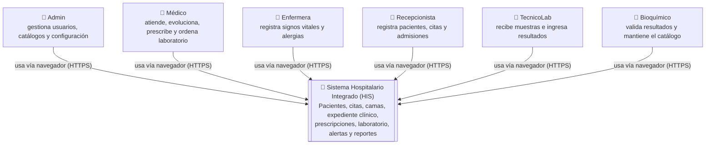
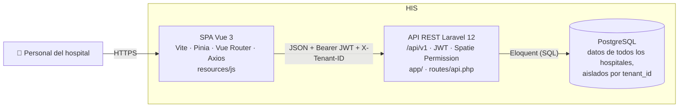
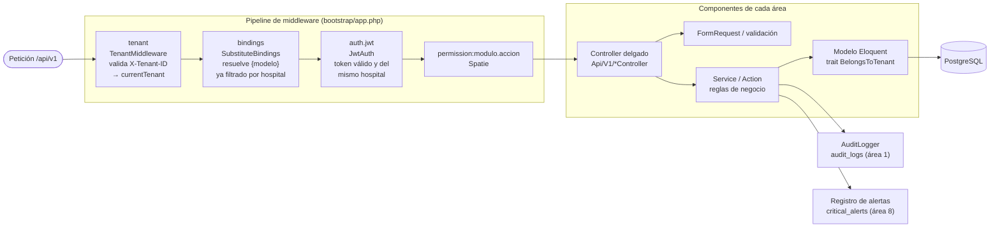
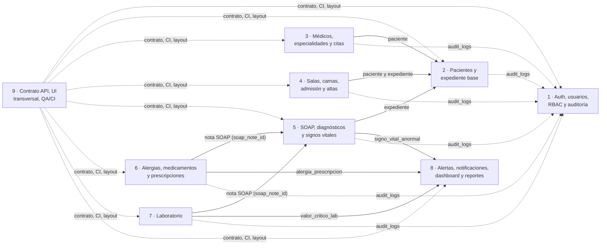

# Arquitectura global del HIS (modelo C4)

Vista global del Sistema Hospitalario Integrado en los niveles 1 (contexto),
2 (contenedores) y 3 (componentes de la API). Cada área documenta **su propia
vista de componentes** en `docs/modulo-<area>.md` y enlaza este documento como
punto de partida (issue #8).

## Nivel 1 · Contexto

Un único sistema atiende a **varios hospitales** (multi-tenant). Cada petición
pertenece a un hospital (`X-Tenant-ID`) y cada usuario a un solo hospital.

## Nivel 2 · Contenedores

| Contenedor | Tecnología | Responsabilidad |
|---|---|---|
| SPA | Vue 3, Vite, Pinia, Vue Router, Axios | Pantallas por área (`resources/js/modules/<area>/`), control visual por permiso. |
| API | Laravel 12, `tymon/jwt-auth`, Spatie Permission | Reglas de negocio, validación, permisos y aislamiento por hospital. |
| Base de datos | PostgreSQL 13+ (`unaccent`) | Persistencia; cada tabla clínica tiene `tenant_id`. |

La seguridad real vive en la API: la SPA oculta opciones por permiso solo por
usabilidad.

## Nivel 3 · Componentes de la API

Toda petición privada atraviesa el mismo pipeline antes de llegar al
controller del área:

| Componente | Dónde | Regla |
|---|---|---|
| `TenantMiddleware` | `app/Http/Middleware` | Corre **antes** del binding (ver #17), así que un id de otro hospital responde 404. |
| `JwtAuth` (`auth.jwt`) | `app/Http/Middleware` | No usar el alias `jwt.auth` del paquete: se salta la validación de hospital. |
| `BelongsToTenant` | `app/Models/Concerns` | Global scope por hospital y `tenant_id` automático al crear. Nunca filtrar a mano. |
| `whereSearch()` | `AppServiceProvider` | Búsqueda sin mayúsculas ni acentos (ILIKE + `unaccent`). |
| Contrato de respuestas | [`docs/contrato-api.md`](contrato-api.md) | Paginator de Laravel, recurso envuelto con su nombre, errores 400/401/403/404/422. |
| `AuditLogger` | `app/Services` (#14) | Acciones sobre datos clínicos. |
| `PatientSummaryResource` | `app/Http/Resources` (#16) | Paciente anidado en respuestas de otras áreas. |

## Mapa de áreas y dependencias

Las líneas punteadas son servicios transversales. Las continuas son datos que
un área necesita de otra; cada una requiere un contrato acordado en un issue,
por ejemplo #11 (5 ↔ 7), #12 (alertas) o #13 (paciente anidado).

## Cómo enlazar la vista de tu área

En `docs/modulo-<area>.md`, en la sección de arquitectura:

1. Enlaza este documento: `[Arquitectura global](arquitectura-c4.md)`.
2. Dibuja **tu** nivel 3: controllers, services, modelos y a qué servicios
   transversales llamas (auditoría, alertas, paciente anidado).
3. Lista los contratos con otras áreas y el issue donde se acordaron.
