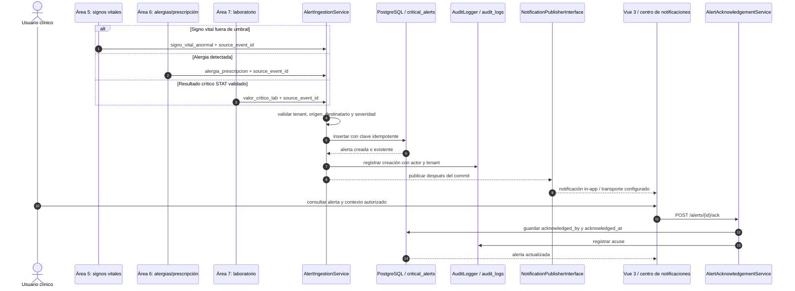

# Documento del Área 8: Alertas Críticas, Notificaciones, Dashboard y Reportes

*Responsable:* Cindy Ruano
*Módulos originales:* 9, 21, 23 y 27
*Entrega:* Semana 2 — Requerimientos RF/RNF, Principios SOLID y Ajustes de Análisis
*Sistema:* Sistema Hospitalario Integrado (HIS)

## 1. Requerimientos Funcionales (RF) y No Funcionales (RNF)

### Requerimientos funcionales

| Código  | Requerimiento                                                              | Criterio de aceptación medible                                           |
|---------|------------------------------------------  --------------------------------|--------------------------------------------------------------------------|
| RF-8.01 | Alertas por alergias, resultados críticos y signos vitales fuera de rango. | Cada evento válido genera alerta con tipo, severidad, paciente y origen. |
| RF-8.02 | Evitar alertas duplicadas con clave idempotente.                           | Múltiples solicitudes iguales producen una sola fila.                    |
| RF-8.03 | Rechazar clave repetida con contenido distinto.                            | Responde 422; filtros solo por severidad, tipo y estado autorizados.     |
| RF-8.04 | Acuse de recibo solo por usuarios autorizados.                             | Registra usuario y fecha/hora; repetidos no duplican acuse.              |
| RF-8.05 | Mostrar KPIs hospitalarios y ocupación por sala.                           | Devuelve camas ocupadas, admisiones, órdenes y alertas críticas.         |
| RF-8.06 | Centro de notificaciones con filtros.                                      | Usuario consulta, filtra y abre contexto; ve solo lo autorizado.         |
| RF-8.07 | Consultar/exportar reportes epidemiológicos.                               | Valida filtros; exporta solo con permiso y datos del tenant.             |

### Requerimientos no funcionales

| Código   | Requerimiento                  | Criterio de aceptación medible                                                                                                                                                                |
|----------|--------------------------------|-----------------------------------------------------------------------------------------------------------------------------------------------------------------------------------------------|
| RNF-8.01 | Aislamiento multitenant.       | Consultas bajo BelongsToTenant y currentTenant resuelto desde X-Tenant-ID; consultar por ID una alerta de otro hospital responde 404 sin revelar su existencia.                               |
| RNF-8.02 | Rendimiento de ingesta.        | Persistencia alcanza p95 <= 200 ms en prueba repetible de 50 solicitudes por segundo durante 10 minutos; la medición excluye el transporte externo.                                           |
| RNF-8.03 | Auditoría clínica.             | Crear alerta y acusar recibo generan eventos append-only en audit_logs con tenant, actor, entidad, acción, identificador y fecha/hora; no queda una operación clínica a medias ante un fallo. |
| RNF-8.04 | Idempotencia.                  | Restricción única persistente por tenant y clave del evento; solicitudes concurrentes repetidas no generan duplicados ni dependen de caché volátil.                                           |
| RNF-8.05 | Seguridad RBAC y minimización. | Rutas privadas requieren JWT, tenant y permiso; payloads/reportes excluyen datos innecesarios; ausencia de permiso responde 403.                                                              |
| RNF-8.06 | Entrega desacoplada.           | La indisponibilidad de WebSocket/SSE no revierte la alerta persistida; fallos de publicación son reintentables y observables sin duplicarla.                                                  |

Los valores de rendimiento son objetivos de diseño a verificar en integración. El límite mide validación y persistencia de la alerta, no la latencia de red ni la visualización en el cliente.

## 2. Aplicación de Principios SOLID

### Single Responsibility Principle (SRP)

| Servicio propuesto       | Responsabilidad única                                                                                                                                |
|--------------------------|------------------------------------------------------------------------------------------------------------------------------------------------------|
| AlertIngestionService    | Validar el contrato del evento, verificar tenant y referencias, aplicar idempotencia y persistir la alerta. No conoce transporte ni construye KPIs.  |
| AlertNotificationService | Preparar y publicar notificaciones a destinatarios autorizados mediante una abstracción de transporte. No decide si un dato es clínicamente crítico. |
| DashboardKpiAggregator   | Consultar/agregar métricas de camas, admisiones, laboratorio y alertas para el tenant activo. No ingiere eventos ni acusa alertas.                   |

Un cambio clínico de clasificación afecta la ingesta, un cambio de transporte afecta al notificador y una nueva métrica afecta al agregador. La separación permite pruebas unitarias por responsabilidad sin acoplar controladores a Eloquent o infraestructura push.

### Dependency Inversion Principle (DIP)

El dominio depende de una abstracción, no de WebSockets ni de una biblioteca concreta. Contrato ilustrativo pendiente de implementación:

```php
interface NotificationPublisherInterface
{
    public function publish(AlertNotification $notification): void;
}
```

Adaptadores futuros pueden usar canal database, WebSockets, SSE o cola. La publicación se efectúa después del commit (afterCommit) o mediante outbox cuando se requiera entrega confiable entre procesos.

## 3. Ajustes de Análisis y Feedback del Líder Técnico

### Severidad, acuse e idempotencia

El esquema actual de critical_alerts no contiene severity, payload, acknowledged_by ni clave idempotente propia. La evolución propuesta añade:

- *severity:* Critical, warning o info; expresa prioridad y no sustituye alert_type ni el estado del dato clínico.
- *acknowledged_by:* FK nullable a users, derivada del usuario autenticado, nunca del payload del cliente.
- *payload:* JSON con referencias y contexto mínimo, sin duplicar expediente, notas o resultados sensibles innecesariamente.
- *source_event_id:* Identificador estable con unicidad por tenant para reintentos idempotentes.

La migración actual utiliza PK incremental bigint. Cambiar a UUID requiere transición compatible de FK, auditoría, seeders, rutas y consumidores. La migración debe ser aditiva y reversible. El acuse guarda `acknowledged_by` y `acknowledged_at` atómicamente; acknowledged se mantiene consistente. Acusar no significa resolver, escalar ni cerrar clínicamente.

### Matriz de roles y permisos (RoleSeeder.php)

Los perfiles funcionales se mapean a los roles técnicos existentes en [`RoleSeeder.php`](../../database/seeders/RoleSeeder.php). Médico Tratante y Médico Director usan actualmente `Médico`; no existe rol separado que permita distinguir permisos entre ambos.

| Perfil funcional       | Rol actual | Permisos/estado actual                                               | Ajuste propuesto                                                                                 |
|------------------------|------------|----------------------------------------------------------------------|--------------------------------------------------------------------------------------------------|
| Médico Tratante        | Médico     | alertas.ver, alertas.confirmar, reportes.ver; sin reportes.exportar. | Mantener permisos de alerta; no habilitar exportación sin aprobación de privacidad.              |
| Médico Director        | Médico     | Mismos permisos de cualquier médico; no hay rol diferenciado.        | Crear rol/capacidad específica o conceder exportación a todos los médicos, solo tras aprobación. |
| Enfermera              | Enfermera  | Tiene alertas.ver, no alertas.confirmar.                             | Añadir alertas.confirmar si la política clínica autoriza el acuse.                               |
| Administrador          | Admin      | Tiene *, incluyendo reportes.exportar.                               | Mantener auditoría y minimización; administración no implica acceso clínico irrestricto.         |
| Bioquímico             | Bioquimico | Tiene alertas.ver; sin confirmar ni exportar.                        | Conservar consulta; ampliar solo con acuerdo explícito.                                          |
| Técnico de laboratorio | TecnicoLab | No tiene alertas.ver.                                                | No habilitar acceso clínico por defecto; valorar notificación operacional separada.              |

alertas.confirmar y reportes.exportar ya existen. El ajuste de Enfermería cambia la asignación en RoleSeeder.php; no crea permiso nuevo. Si Médico Director sigue mapeado a `Médico`, RBAC no puede separarlo de los demás médicos.

### Diagrama de secuencia e integración



Cada área de origen valida su propio evento. En el monolito se invoca el servicio directamente; si el consumidor es externo se usa outbox y reintentos idempotentes, no una llamada HTTP interna que rompa la transacción.
