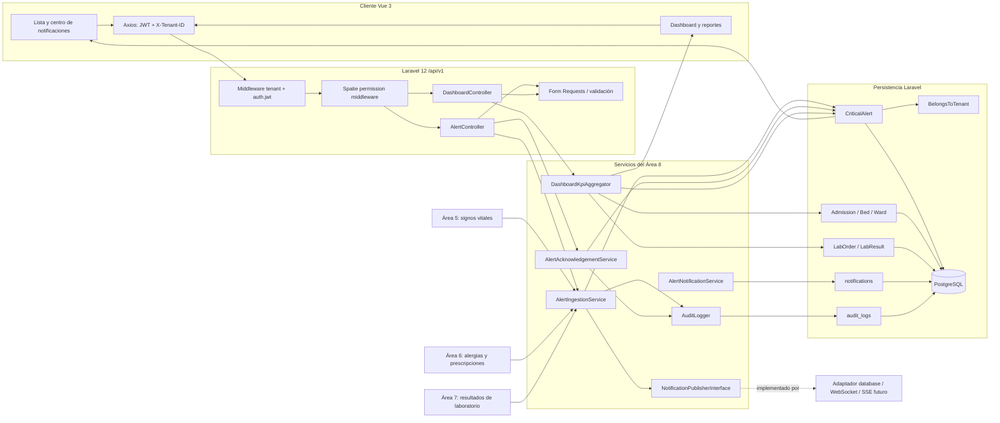

# Documento del Área 8: Alertas Críticas, Notificaciones, Dashboard y Reportes

*Responsable:* Cindy Ruano
*Módulos originales:* 9, 21, 23 y 27
*Entrega:* Semana 3 — Vista Arquitectónica del Módulo (C4 Level 3 - Componentes)
*Sistema:* Sistema Hospitalario Integrado (HIS)

## 1. Diagrama de Componentes

Vista lógica propuesta para el monolito Laravel 12. Las Áreas 5, 6 y 7 validan los datos de origen y generan eventos; el Área 8 gestiona su ingesta idempotente, acuse, notificación y presentación. Las rutas y servicios del Área 8 aún son diseño, no implementación existente.

## 2. Descripción de Componentes Clave

| Componente                  | Responsabilidades                                                                                               | Entradas                                          | Salidas                                           | Dependencias directas                                                     |
|-----------------------------|-----------------------------------------------------------------------------------------------------------------|---------------------------------------------------|---------------------------------------------------|---------------------------------------------------------------------------|
| AlertController             | Exponer listado, ingesta y acción de acuse; traducir HTTP a servicios, sin reglas de dominio.                   | Request, filtros validados o evento autorizado.   | JSON y códigos HTTP conforme al contrato común.   | Form Requests, AlertIngestionService, servicio de acuse.                  |
| DashboardController         | Exponer KPIs y validar filtros temporales.                                                                      | Request, tenant y permisos efectivos.             | JSON con métricas y fecha de cálculo.             | DashboardKpiAggregator.                                                   |
| Form Requests               | Validar severidad, tipo, IDs, clave idempotente, filtros y paginación.                                          | Input HTTP.                                       | Datos validados o 422.                            | Reglas Laravel y contexto autenticado.                                    |
| AlertIngestionService       | Validar origen/referencias, tenant, idempotencia y persistencia; coordinar auditoría y publicación post-commit. | Evento validado de Áreas 5, 6 o 7.                | Alerta creada o existente.                        | CriticalAlert, BelongsToTenant, AuditLogger, outbox/publicador.           |
| AlertAcknowledgementService | Aplicar transición pendiente→acusada y registrar actor y hora atómicamente.                                     | ID de alerta, usuario autenticado, tenant actual. | Alerta actualizada; repetición idempotente.       | CriticalAlert, AuditLogger y transacción DB.                              |
| AlertNotificationService    | Preparar notificación y publicarla tras commit; permitir reintentos.                                            | Alerta persistida y destinatarios autorizados.    | Notificación in-app/evento de transporte.         | NotificationPublisherInterface, canal database/adaptador y cola opcional. |
| DashboardKpiAggregator      | Calcular ocupación, admisiones, órdenes de laboratorio y alertas críticas bajo tenant/permiso.                  | Tenant, ventana y filtros validados.              | Agregados sin datos personales innecesarios.      | Bed, Admission, Ward, LabOrder, CriticalAlert.                            |
| CriticalAlert               | Modelo Eloquent, relaciones/casts y aislamiento por tenant.                                                     | Atributos validados en servidor.                  | Registro tenant-scoped.                           | Eloquent y trait BelongsToTenant.                                         |
| BelongsToTenant             | Scope global por currentTenant; asigna tenant al crear si falta.                                                | Contexto resuelto por middleware tenant.          | Consultas/creaciones acotadas al hospital activo. | Contenedor Laravel y tenant actual.                                       |
| PostgreSQL                  | Persistir alertas, notificaciones y auditoría con restricciones e índices.                                      | Operaciones Eloquent/transacciones.               | Datos consistentes y consultas indexadas.         | Migraciones y conexión del HIS.                                           |

Las reglas de clasificación clínica permanecen en el área de origen. No se añade Repository por obligación: se conserva Eloquent y servicios, agregando esa abstracción solo ante una necesidad de persistencia comprobable.
