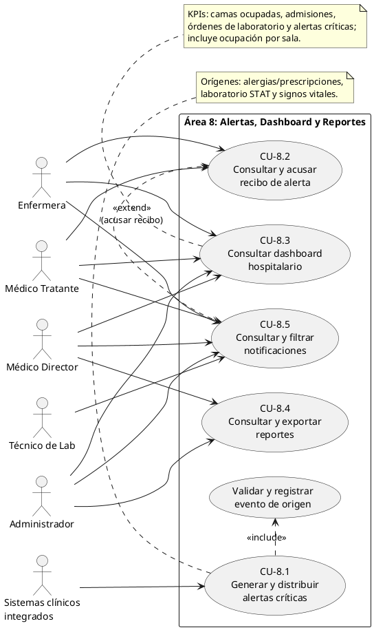

# Documento del Área 8: Alertas Críticas, Notificaciones, Dashboard y Reportes

*Responsable:* Cindy Ruano  
*Módulos originales:* 9, 21, 23 y 27  
*Entrega:* Semana 1 — diagnóstico, actores y casos de uso  
*Sistema:* Sistema Hospitalario Integrado (HIS)

## 1. Propósito y alcance del módulo

El Área 8 centraliza la generación, distribución, consulta y seguimiento de alertas clínicas críticas, además de ofrecer un centro de notificaciones, un panel de control hospitalario y reportes epidemiológicos y estadísticos. Su propósito es ayudar al personal autorizado a identificar eventos que requieren atención oportuna y facilitar la supervisión clínica y operacional, sin sustituir el criterio profesional ni los módulos que originan los datos.

El flujo de alertas se integra con los módulos clínicos del HIS:

- *Alergias y prescripciones (Área 6):* Una alergia relevante detectada al registrar o validar una prescripción genera una alerta de tipo `alergia_prescripcion` y comunica el riesgo al personal clínico responsable, antes de que el tratamiento continúe según las reglas acordadas con esa área.
- *Laboratorio (Área 7):* La validación de un resultado crítico de una orden STAT genera una alerta de tipo `valor_critico_lab`, dirigida al médico responsable de la orden. La alerta debe conservar el vínculo con el resultado y el paciente.
- *Signos vitales (Área 5):* Un valor que exceda los umbrales clínicos configurados genera una alerta de tipo `signo_vital_anormal`, vinculada al paciente y disponible para el personal asistencial autorizado.

Las alertas deben presentarse con su tipo, severidad, fecha y hora, paciente y contexto clínico mínimo necesario. El personal autorizado puede consultarlas y registrar su acuse de recibido. El acuse confirma que la alerta fue vista; no equivale a resolver el evento clínico ni a modificar el resultado que la originó. La política de asignación, escalamiento y cierre deberá concretarse con las áreas clínicas dependientes.

El centro de notificaciones reúne las alertas dirigidas al usuario y permite consultar su estado. El dashboard presenta indicadores operacionales y clínicos, entre ellos camas ocupadas, admisiones, órdenes de laboratorio y alertas críticas, además de un resumen de ocupación por sala. La información y las acciones disponibles se limitan según el rol y los permisos del usuario.

El módulo de reportes permite consultar y exportar estadísticas epidemiológicas y operacionales para usuarios autorizados. Los resultados deben respetar el hospital activo, los filtros disponibles y las restricciones de acceso a datos clínicos identificables.

### Límites e integraciones

- Las áreas de prescripciones, laboratorio y signos vitales son responsables de validar y persistir sus datos de origen; el Área 8 consume sus eventos o registros mediante contratos acordados.
- El Área 8 es responsable de presentar y dar seguimiento a alertas y notificaciones, agregar indicadores del dashboard y ofrecer reportes dentro de los permisos definidos.
- Las camas, admisiones y salas se obtienen de los módulos responsables de hospitalización y admisión; las órdenes y resultados proceden del módulo de laboratorio.
- El módulo no define diagnósticos, tratamientos ni umbrales clínicos. Estos deben acordarse con responsables clínicos y mantenerse configurables de acuerdo con la política institucional.
- Cada consulta y operación se ejecuta dentro del tenant del hospital autenticado. No se permite combinar alertas, pacientes, camas, órdenes o estadísticas de hospitales distintos.

## 2. Actores del sistema

| Actor                        | Responsabilidades en el módulo                                                                                                                                                                                                                                     |
|------------------------------|--------------------------------------------------------------------------------------------------------------------------------------------------------------------------------------------------------------------------------------------------------------------|
| Médico Director              | Consulta indicadores agregados de actividad, ocupación y alertas críticas del hospital; revisa reportes epidemiológicos y estadísticos para supervisión y planificación. Su acceso a detalle clínico se limita a los permisos asignados.                           |
| Médico Tratante              | Recibe y consulta alertas relacionadas con sus pacientes o con órdenes bajo su responsabilidad; registra el acuse de recibido, revisa el contexto clínico disponible y continúa la atención en el módulo clínico correspondiente.                                  |
| Enfermera                    | Consulta alertas y notificaciones pertinentes a los pacientes bajo su atención, registra el acuse cuando está autorizada y utiliza el panel operacional para dar seguimiento a la actividad asistencial. No altera resultados ni reglas clínicas de otros módulos. |
| Técnico de Lab               | Consulta notificaciones operacionales que correspondan sobre órdenes y flujo de laboratorio. Registra y procesa muestras y resultados en el Área 7; validación del resultado crítico y generación de su alerta siguen las responsabilidades definidas.             |
| Administrador                | Gestiona usuarios, roles y permisos a través de las funciones administrativas del HIS; consulta los indicadores y reportes autorizados para su rol. No obtiene acceso clínico irrestricto por el solo hecho de administrar el sistema.                             |
| Sistemas clínicos integrados | Actor externo que representa las áreas de prescripciones, laboratorio y signos vitales que producen los eventos necesarios para generar alertas. La interacción concreta se realiza mediante la integración acordada entre módulos.                                |

Los actores funcionales no implican que exista un rol técnico con idéntico nombre. La autorización efectiva se resolverá con los roles y permisos definidos en el control de acceso del HIS; la matriz de permisos específica del Área 8 deberá acordarse durante el diseño de las siguientes semanas.

## 3. Casos de uso

### CU-8.1 — Generar y distribuir alertas críticas en tiempo real

- *Actores principales:* Sistemas clínicos integrados.
- *Actores interesados:* Médico Tratante, Enfermera.
- *Disparadores:* Setección de una alergia relevante durante una prescripción, validación de un resultado crítico de laboratorio STAT o registro de signos vitales que excedan los umbrales configurados.
- *Flujo principal:* El sistema de origen valida el evento; se crea o comunica una alerta con su tipo, severidad, paciente, fecha y hora, referencia al contexto de origen y destinatario según las reglas acordadas; el Área 8 la hace disponible a los usuarios autorizados en el centro de notificaciones y en las vistas pertinentes.
- *Excepciones y reglas:* Un usuario de otro tenant no puede consultar la alerta; un evento duplicado debe manejarse según una regla de idempotencia acordada; si no existe destinatario válido, el evento debe quedar trazable para su revisión y no descartarse silenciosamente.
- *Resultado:* Alerta persistida y disponible para seguimiento, sin alterar el registro clínico de origen.

### CU-8.2 — Consultar y acusar recibo de una alerta

- *Actor principal:* Médico Tratante.
- *Actores participantes:* Enfermera y demás usuarios clínicos autorizados.
- *Precondiciones:* El usuario está autenticado, pertenece al tenant activo y tiene permiso para consultar o acusar recibo de la alerta.
- *Flujo principal:* El usuario abre una alerta, revisa la información clínica mínima y su referencia al registro de origen, y selecciona la acción de acuse; el sistema registra el usuario y la fecha/hora del acuse y actualiza el estado mostrado.
- *Reglas:* El acuse acredita recepción, no resolución clínica; no se permite acusar recibo de una alerta fuera del tenant o fuera del alcance autorizado del usuario. Los cambios de estado deben ser trazables conforme a las políticas de auditoría del HIS.
- *Resultado:* El estado de recepción queda actualizado y visible para los usuarios autorizados.

### CU-8.3 — Consultar el panel de control hospitalario

- *Actores principales:* Médico Director, Médico Tratante, Enfermera y Administrador, de acuerdo con sus permisos.
- *Precondiciones:* Usuario autenticado y tenant activo.
- *Flujo principal:* El usuario abre el dashboard; el sistema presenta los indicadores permitidos para su rol y el hospital actual: camas ocupadas, admisiones, órdenes de laboratorio y alertas críticas; presenta también la ocupación agrupada por sala y el acceso a alertas clínicas recientes. El usuario aplica filtros de severidad en la lista de alertas cuando su rol lo permite.
- *Reglas:* Las cifras se calculan sobre datos del tenant actual y deben indicar el período o momento de referencia cuando corresponda. Las métricas agregadas no deben revelar información identificable a usuarios sin permiso clínico.
- *Resultado:* Vista resumida y actualizada de la situación clínica y operacional autorizada.

### CU-8.4 — Consultar y exportar reportes epidemiológicos y estadísticos

- *Actores principales:* Médico Director y Administrador autorizado.
- *Actores participantes:* Otros usuarios con permiso de consulta de reportes.
- *Flujo principal:* El actor selecciona el tipo de reporte, el período y los filtros habilitados; el sistema valida los criterios, consulta únicamente los datos del tenant activo, presenta los resultados y permite exportarlos en los formatos habilitados por el HIS.
- *Reglas:* La exportación está sujeta a permisos, minimización de datos y protección de información clínica; los filtros y definiciones estadísticas deben ser consistentes y documentados. Los formatos concretos (por ejemplo, CSV o PDF) se confirmarán durante el diseño del contrato de reportes.
- *Resultado:* Reporte consultable y, si está autorizado, descargable con filtros y período identificables.

### CU-8.5 — Consultar y filtrar el centro de notificaciones

- *Actor principal:* Usuario autenticado con permiso de consulta.
- *Actores participantes:* Médico Tratante, Enfermera, Técnico de Lab, Médico Director y Administrador, conforme a sus responsabilidades y permisos.
- *Flujo principal:* El usuario abre el centro de notificaciones; el sistema lista las notificaciones dirigidas o visibles para su rol, permite filtrar las alertas clínicas recientes por severidad y estado, y facilita abrir el contexto permitido. Desde una alerta con autorización de acuse, el usuario puede continuar el flujo de CU-8.2.
- *Reglas:* Solo se presentan registros del hospital y del ámbito de acceso del usuario; la lista debe diferenciar alertas pendientes de acuse de aquellas ya acusadas.
- *Resultado:* Notificaciones relevantes organizadas y accesibles para su seguimiento.

## 4. Narrativa breve del alcance y flujo

El usuario inicia sesión en el HIS y accede a la pantalla principal que le corresponde según su rol. En el dashboard se muestran tarjetas KPI para camas ocupadas, admisiones, órdenes de laboratorio y alertas críticas, junto con el resumen de ocupación por sala. La información se calcula para el hospital asociado a la sesión y se limita a los permisos del usuario.

En paralelo a la actividad clínica, los módulos de origen generan eventos cuando detectan una alergia relevante en una prescripción, se valida un valor crítico de laboratorio STAT o se registra un signo vital fuera de los umbrales institucionales. El Área 8 convierte o recibe cada evento como alerta trazable y la presenta en el centro de notificaciones y en la lista de alertas clínicas recientes. El usuario autorizado puede filtrar esa lista por severidad, abrir el contexto mínimo necesario y acusar recibo. La atención y resolución clínica continúan en el módulo correspondiente.

El Médico Director u otro usuario autorizado accede a reportes epidemiológicos y estadísticos, aplica filtros y exporta los resultados permitidos. Los reportes y el dashboard agregan datos de las áreas integradas, pero nunca mezclan información de tenants ni amplían los permisos de acceso a datos individuales.

La interfaz se propone bajo el sistema visual Clinical Clarity HIS: teal `#0D9488` como color primario, azul noche `#0F172A` para superficies oscuras, azul `#0284C7` para interacciones, rojo `#DC2626` para estados críticos/urgentes y naranja `#F59E0B` para advertencias. La tipografía definida es Inter para titulares, texto y etiquetas. La severidad debe comunicarse con texto y señales visuales consistentes, no únicamente mediante color. Esta narrativa describe los componentes indicados para el diseño; no presupone capturas adicionales.

## 5. Estructura del diagrama UML de casos de uso

El siguiente diagrama PlantUML representa los límites del Área 8, sus actores humanos y los sistemas clínicos integrados que originan eventos. Las relaciones `include` expresan que la generación de una alerta requiere validar y registrar el evento de origen; no representan una decisión clínica automática del Área 8.

