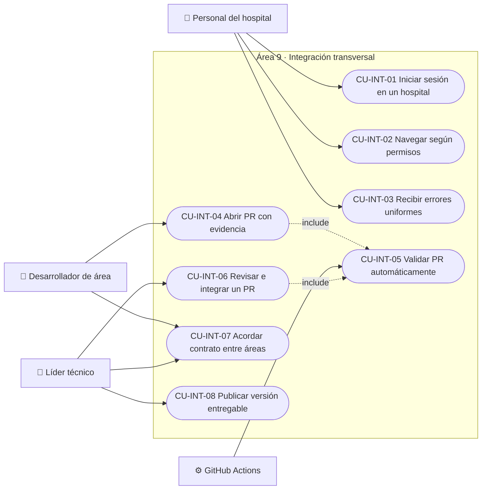
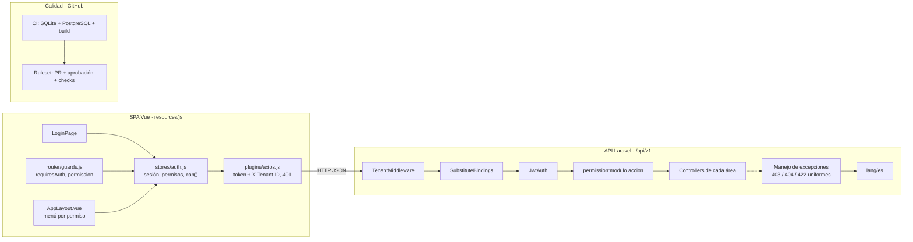

# ASII-09 - Integración transversal: contrato API, UI transversal, QA/CI e integración

Responsable: Axel Herrera (`AxelHerrera11`), líder técnico  
Módulos originales: 24, 25, 26 y 28 · Issue épico: #42  
Parte de: [Arquitectura global del HIS](arquitectura-c4.md) · [Contrato común de la API](contrato-api.md)

El área 9 no atiende un proceso clínico: construye y mantiene **lo que todas las áreas
comparten** para que nueve módulos desarrollados en paralelo funcionen como un solo sistema.
Este documento cubre las entregas de las semanas 1 a 5 del [plan semanal](weekly-plan.md)
aplicadas a ese alcance.

| Semana | Entregable | Sección |
|---:|---|---|
| 1 | Alcance, actores y casos de uso | 1 y 2 |
| 2 | RF/RNF con criterios de aceptación y principio SOLID | 3 y 4 |
| 3 | Vista arquitectónica (C4 nivel 3 de lo transversal) | 5 |
| 4 | Capas, responsabilidades y objetos reutilizables | 6 |
| 5 | Contrato API y plan de integración (rama, worktree, PR) | 7 |

## 1. Alcance

| Submódulo | Qué incluye | Dónde vive |
|---|---|---|
| **CON** · Contrato API | Formato común de listados, recursos y errores; cabeceras; idioma de los mensajes | `docs/contrato-api.md`, `bootstrap/app.php`, `lang/es/` |
| **SEG** · Seguridad base | Hospital por petición (`X-Tenant-ID`), JWT ligado al hospital, aislamiento automático, permisos por ruta | `TenantMiddleware`, `JwtAuth`, `BelongsToTenant`, `RoleSeeder` |
| **UI** · UI transversal | Login, layout, menú por permiso, guard de rutas, cliente HTTP, sesión | `resources/js/plugins`, `stores`, `router`, `shared` |
| **QA** · Calidad y CI | Pruebas en SQLite y PostgreSQL, build del frontend, checks obligatorios, plantillas de PR | `.github/`, `phpunit*.xml`, ruleset del repositorio |
| **INT** · Integración | Convenciones de ramas y archivos compartidos, revisión de PR, contratos entre áreas, versiones en `main` | `README.md`, `docs/arquitectura-c4.md`, issues de coordinación |

**Fuera de alcance:** las reglas de negocio de cada área (pacientes, citas, laboratorio,
etc.), que pertenecen a su responsable. El área 9 define *cómo* se integran, no *qué* hacen.

## 2. Actores y casos de uso

| Actor | Descripción |
|---|---|
| Personal del hospital | Cualquier usuario con rol (Admin, Médico, Enfermera, TecnicoLab, Bioquimico, Recepcionista). Usa el login, el layout y la navegación. |
| Desarrollador de área | Integrante responsable de un área 1-8. Consume el contrato, las convenciones y el CI. |
| Líder técnico | Revisa y aprueba PR, define contratos entre áreas y publica versiones. |
| GitHub Actions (CI) | Sistema externo que ejecuta pruebas y build en cada PR y push. |



| CU | Narrativa breve |
|---|---|
| CU-INT-01 | El usuario indica su hospital y credenciales; recibe un JWT válido solo para ese hospital. Un token usado con otro `X-Tenant-ID` responde 403. |
| CU-INT-02 | El menú y las rutas de la SPA muestran solo los módulos cuyo permiso tiene el usuario; la API vuelve a validar el permiso en cada ruta. |
| CU-INT-03 | Ante un error, la API responde siempre el mismo formato (`message` y, en 422, `errors` por campo) en español; un id de otro hospital responde 404 sin revelar que existe. |
| CU-INT-04 | El desarrollador crea una rama desde `develop`, abre un PR con la plantilla y adjunta la evidencia de pruebas. |
| CU-INT-05 | El CI ejecuta las pruebas en SQLite y PostgreSQL y el build del frontend; si falla, el PR no se puede mergear. |
| CU-INT-06 | El líder revisa contra el contrato, la seguridad y la DoD; aprueba o pide cambios, y verifica conflictos con otros PR. |
| CU-INT-07 | Cuando un área necesita datos o servicios de otra, se abre un issue de coordinación y se documenta el acuerdo (p. ej. #13 paciente anidado, #12 alertas). |
| CU-INT-08 | Al cierre de cada hito, `develop` se integra en `main` mediante PR y se etiqueta la versión. |

## 3. Requerimientos

### 3.1 Funcionales

| ID | Requerimiento | Criterio de aceptación | Evidencia |
|---|---|---|---|
| RF-INT-01 | Exigir `X-Tenant-ID` válido en toda ruta de la API. | Sin cabecera o con un valor que no es UUID responde 400; un hospital inexistente, 404. | `AuthTest` (cabecera ausente y no UUID), `TenantMiddleware` |
| RF-INT-02 | Ligar el JWT al hospital del usuario. | Token de un hospital usado con otro `X-Tenant-ID` → 403. | `AuthTest::test_token_is_rejected_with_a_different_tenant_header` |
| RF-INT-03 | Aislar automáticamente los datos por hospital, también en rutas con `{modelo}`. | Un id de otro hospital responde 404 en listados, detalle, edición y cambios de estado. | `TenantIsolationTest` (#17) |
| RF-INT-04 | Proteger cada ruta con un permiso `modulo.accion`. | Sin el permiso → 403 con `No tiene permiso para realizar esta acción.` | Pruebas 403 de cada área |
| RF-INT-05 | Responder con un formato común de listados, recursos y errores. | Paginator de Laravel (`per_page` ≤ 50), recurso envuelto en singular, 422 con `errors`. | `docs/contrato-api.md` |
| RF-INT-06 | Mostrar los errores de validación en español con nombres de campo legibles. | `El campo apellido es obligatorio.` | `ApiErrorFormatTest` (#27) |
| RF-INT-07 | Mostrar en la SPA solo las rutas y enlaces permitidos. | El guard redirige si falta `meta.permission`; el menú usa `auth.can()`. | `router/guards.js`, `AppLayout.vue` |
| RF-INT-08 | Cerrar la sesión cuando el token vence. | Una respuesta 401 limpia la sesión y redirige a `/login`. | `plugins/axios.js` |
| RF-INT-09 | Validar cada PR automáticamente. | Pruebas en SQLite y PostgreSQL + build; checks obligatorios en `develop` y `main`. | `.github/workflows/ci.yml`, ruleset |
| RF-INT-10 | Dar a cada área un lugar propio en los archivos compartidos. | Rutas, menú, router y traducciones con un bloque comentado por área. | `routes/api.php`, `router/index.js`, `AppLayout.vue`, `lang/es/validation.php` |

### 3.2 No funcionales

| ID | Requerimiento | Criterio de aceptación |
|---|---|---|
| RNF-INT-01 | Seguridad: ningún dato clínico cruza hospitales. | Cobertura de aislamiento en cada área; revisión de `BelongsToTenant` en cada PR. |
| RNF-INT-02 | Compatibilidad PostgreSQL. | Toda la suite pasa con `phpunit.pgsql.xml` en el CI. |
| RNF-INT-03 | Rapidez del CI. | Cada ejecución termina en menos de 3 minutos (hoy ~1 min). |
| RNF-INT-04 | No exponer detalles internos. | Los 404 no revelan clases ni ids; `APP_DEBUG=false` en producción. |
| RNF-INT-05 | Mantenibilidad: integración sin conflictos. | Un área agrega rutas o pantallas tocando solo su bloque; los PR de áreas distintas no chocan. |
| RNF-INT-06 | Trazabilidad. | Todo cambio entra por PR con issue relacionado (`Refs #`), revisión aprobada y CI en verde; las ramas mergeadas se conservan. |
| RNF-INT-07 | Usabilidad: un solo idioma. | Mensajes de API y validación en español (`APP_LOCALE=es`). |

## 4. Principio SOLID aplicado

Fuente: `https://mvpcluster.com/diseno-de-software-2/`.

**Open/Closed — los bloques por área.** Los archivos compartidos (`routes/api.php`,
`resources/js/router/index.js`, `AppLayout.vue`, `lang/es/validation.php`) están
**abiertos a extensión** (cada área agrega su bloque) y **cerrados a modificación** (nadie
cambia la estructura ni los bloques de otro). En el router, la carga diferida
(`component: () => import(...)`) hace que una pantalla nueva no toque los imports
compartidos:

```js
// ── Área 7: Laboratorio ─────────────────────────────
{
    path: '/laboratorio/ordenes',
    name: 'laboratorio-ordenes',
    component: () => import('@/modules/laboratorio/pages/LabOrdersPage.vue'),
    meta: { requiresAuth: true, permission: 'laboratorio.ver' },
},
```

**Single Responsibility — el pipeline de seguridad.** Cada middleware tiene una sola razón
para cambiar: `TenantMiddleware` resuelve el hospital, `JwtAuth` autentica y verifica que
el token sea de ese hospital, y `permission:*` (Spatie) autoriza. Por eso el arreglo de #17
se resolvió cambiando **solo el orden** (`prependToPriorityList`) en `bootstrap/app.php`, sin
tocar la lógica de ningún middleware ni de ningún controller.

## 5. Vista arquitectónica (C4 nivel 3)

Los niveles 1 y 2 y el mapa de áreas están en [`arquitectura-c4.md`](arquitectura-c4.md).
Esta vista muestra los componentes transversales que mantiene el área 9.



## 6. Capas, responsabilidades y objetos reutilizables

| Capa | Componentes transversales | Responsabilidad | No debe |
|---|---|---|---|
| Presentación | `AppLayout.vue`, `LoginPage.vue`, `router/guards.js` | Navegación, sesión visible, ocultar lo no permitido | Ser la única barrera de seguridad |
| Cliente HTTP | `plugins/axios.js`, `stores/auth.js` | Adjuntar token y hospital; reaccionar al 401; guardar permisos | Conocer reglas de un área |
| API (borde) | `TenantMiddleware`, `JwtAuth`, `permission:*`, `bootstrap/app.php` | Hospital, autenticación, autorización, formato de errores | Contener reglas de negocio |
| Dominio compartido | `BelongsToTenant`, macro `whereSearch()`, `lang/es` | Aislamiento automático, búsqueda sin acentos, mensajes | Filtrar `tenant_id` a mano |
| Calidad | `ci.yml`, `phpunit.xml`, `phpunit.pgsql.xml`, ruleset, plantillas | Impedir que entre código que rompe pruebas o build | Reemplazar la revisión humana |

| Objeto reutilizable | Ubicación | Quién lo usa |
|---|---|---|
| `BelongsToTenant` | `app/Models/Concerns` | Todos los modelos con `tenant_id` |
| `whereSearch()` | `AppServiceProvider` | Buscadores de pacientes, citas, laboratorio, camas |
| Formato de errores 403/404 | `bootstrap/app.php` | Todas las rutas de la API |
| `lang/es/validation.php` | `lang/es` | Todas las validaciones (un bloque por área) |
| `api` (axios) | `resources/js/plugins/axios.js` | Todas las pantallas |
| `useAuthStore().can()` | `resources/js/stores/auth.js` | Menú, guard y botones de cada pantalla |
| Plantillas de PR e issue | `.github/` | Todos los PR e issues épicos |

## 7. Contrato API y plan de integración

**Contrato:** [`docs/contrato-api.md`](contrato-api.md) define cabeceras, listados
paginados, recurso individual, paciente anidado (`PatientSummaryResource`, #13) y los errores
400/401/403/404/422. Cada área documenta sus endpoints en su propio `docs/modulo-<area>.md`.

**Flujo de integración** (detalle en el README, sección "Flujo de trabajo con Git"):

1. Issue épico o de coordinación → rama `feature/<area>-<tema>` desde `develop` (worktree opcional, ver [`worktree-guide.md`](worktree-guide.md)).
2. PR hacia `develop` con la plantilla y `Refs #<issue>`.
3. CI obligatorio: `backend (SQLite + PostgreSQL)` y `frontend (build)`.
4. Revisión del líder: contrato, seguridad, DoD y conflictos con otros PR abiertos.
5. Merge; la rama se conserva como historial y no se reutiliza. En PR apilados, la base se cambia a `develop` a mano.
6. En cada hito (parciales y entrega final) se integra `develop` en `main` y se etiqueta la versión.

**Contratos entre áreas que coordina el área 9:**

| Issue | Contrato | Estado |
|---|---|---|
| #7 | Formato de respuestas | Resuelto (`contrato-api.md`) |
| #8 | C4 global, plantillas, convención de frontend | Resuelto (`arquitectura-c4.md`, `.github/`) |
| #13 | Paciente anidado | Resuelto (`PatientSummaryResource`, #16) |
| #12 | Registro de alertas críticas (áreas 5, 6, 7 → 8) | Pendiente de decisión |
| #11 | Órdenes de laboratorio ↔ notas SOAP (áreas 5 y 7) | Pendiente de respuesta |
| #9 | `AuditLogger` común (área 1) | PR #14 en revisión |

## 8. Avance y próximos pasos

| Fecha | Avance | Evidencia |
|---|---|---|
| 2026-10-05 | Revisión técnica del repositorio y fix de aislamiento en binding implícito | #17 |
| 2026-10-05 | Plantillas, CI y contrato común de la API | #18 |
| 2026-10-05 | C4 global y convención de frontend | #26 |
| 2026-10-05 | Errores en español y 404 genérico | #27 |
| 2026-10-06 | Política de ramas mergeadas y PR apilados | #33 |

Próximos pasos:

- Decidir el contrato de alertas (#12) y documentarlo.
- UI transversal (semanas 7 y 8): tokens de diseño, componentes compartidos (tabla paginada,
  campo con errores 422, badge de estado, confirmación, notificaciones) y manejo uniforme de
  403/404 en el cliente.
- Versión `v0.1.0` en `main` para el parcial 1.
- Semanas 13-17: plan de revisión técnica y SQA, despliegue en staging y matriz de amenazas global.
