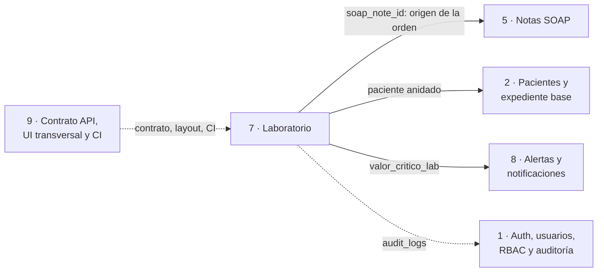
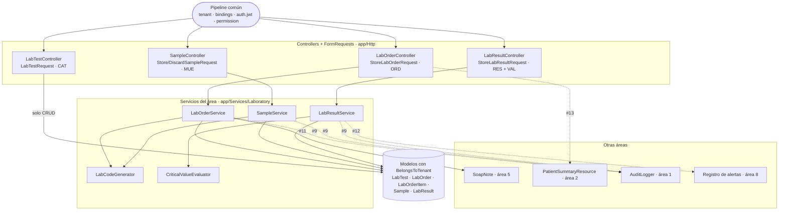
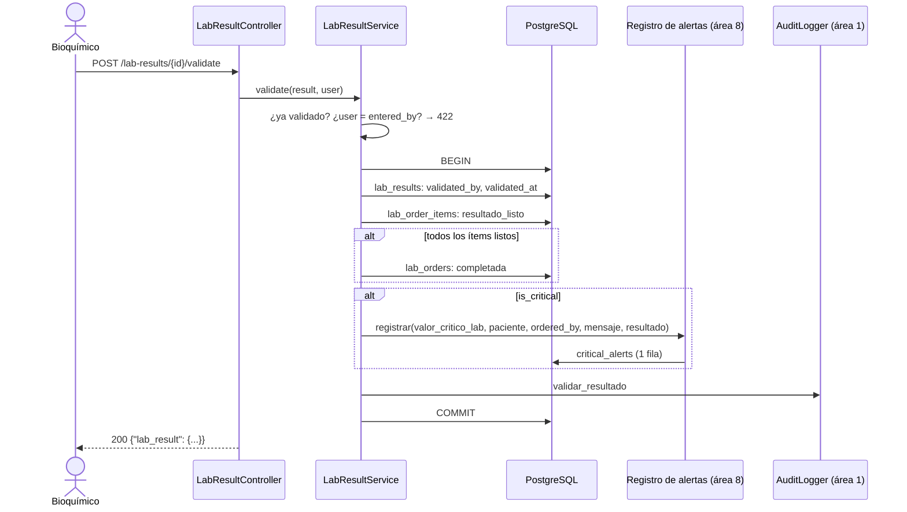
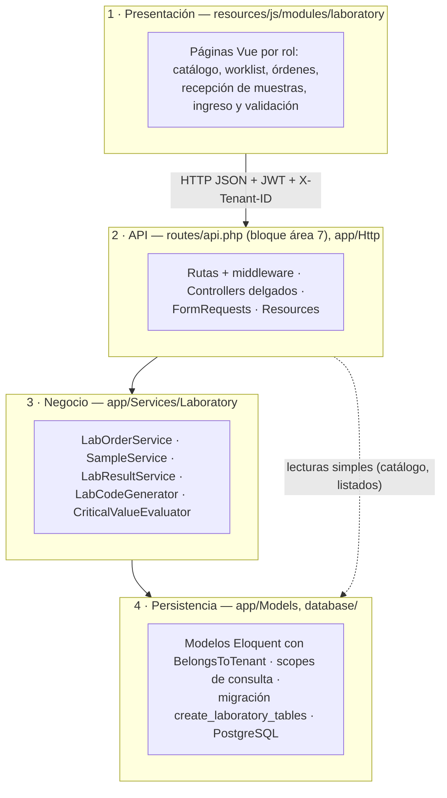

# ASII-07 - Laboratorio clínico: arquitectura y contrato API preliminar

Responsable: Josué Hicho (`Jhos-hgnu`)  
Complementa: [`modulo-laboratorio.md`](modulo-laboratorio.md) (análisis, RF/RNF y reglas de negocio)  
Parte de: [Arquitectura global del HIS](arquitectura-c4.md) y [contrato común de la API](contrato-api.md)

Este documento cubre las entregas de diseño del área 7 para las semanas 3 a 5 del
[plan semanal](weekly-plan.md):

| Semana | Entregable | Sección |
|---:|---|---|
| 3 | Vista arquitectónica del módulo y sus dependencias con el HIS (C4 nivel 3) | 1 y 2 |
| 4 | Diagrama por capas, responsabilidades, patrón repositorio y objetos reutilizables | 3 |
| 5 | Contrato API preliminar (endpoints, payloads, respuestas, errores, permisos) y plan de rama/worktree/PR | 4 y 5 |

Los códigos de requerimientos (`RF-…`, `RNF-…`), casos de uso (`CU-…`), reglas (8.x) y
hallazgos (`H-…`) son los de `modulo-laboratorio.md`. **Preliminar** quiere decir que lo
implementado puede ajustar nombres o campos; cada fase actualiza su sección de endpoints en
`modulo-laboratorio.md`, que es la referencia final.

## 1. El laboratorio dentro del HIS

El área 7 vive dentro de los mismos contenedores que el resto del HIS (SPA Vue, API Laravel y
PostgreSQL, ver niveles 1 y 2 en `arquitectura-c4.md`). Sus dependencias con otras áreas son:



| Contrato con | Qué usa laboratorio | Issue | Estado |
|---|---|---|---|
| Área 2 | Paciente anidado con `id`, `code`, `first_name`, `last_name`, `birth_date`, `gender` (`PatientSummaryResource`) | #13 | Acordado en `contrato-api.md` §3; PR #16 en revisión |
| Área 5 | Nota SOAP como origen de la orden; `SoapNoteFactory`, `SoapNote::labOrders()`, borrado y firma | #11 | Pendiente |
| Área 8 | Registro de la alerta `valor_critico_lab` dentro de la transacción de validación | #12 | Pendiente; el área 9 propone un servicio común `registrar(tipo, paciente, destinatario, mensaje, origen)` |
| Área 1 | `AuditLogger` para acciones clínicas (RNF-LAB-05) | #9 | PR #14 en revisión |
| Área 9 | Formato de respuestas, errores, paginación, C4 global y CI | #7, #8 | Resuelto |

## 2. Vista de componentes (C4 nivel 3)

Toda petición pasa primero por el pipeline común (`tenant` → `bindings` → `auth.jwt` →
`permission:laboratorio.*`) descrito en `arquitectura-c4.md`. Esta vista muestra solo lo que
agrega el área 7.



| Componente | Responsabilidad | Fase | Estado |
|---|---|---|---|
| `LabTestController` + `LabTestRequest` | Catálogo: listar, ver, crear, editar y desactivar; coherencia de rangos | F1 | PR de catálogo en revisión |
| `LabOrderController` | Crear, listar, ver y cancelar órdenes; worklist | F2 | Planeado |
| `LabOrderService` | Resuelve paciente y expediente desde la nota SOAP, valida pruebas activas, genera el código y crea orden + ítems en una transacción | F2 | Planeado |
| `LabCodeGenerator` | Códigos `LAB-{PREFIJO}-{AAAA}{NNNN}` y `BC-{PREFIJO}-{NNNNNN}` (regla 8.2), reintento ante colisión | F2-F3 | Planeado |
| `SampleController` + `SampleService` | Toma, recepción y descarte; mueve ítems a `muestra_recibida` y la orden a `en_proceso` | F3 | Planeado |
| `LabResultController` + `LabResultService` | Ingreso (clasifica con el evaluador), validación con segregación, cierre de la orden y alerta crítica | F4 | Planeado |
| `CriticalValueEvaluator` | Regla 8.3 como función pura: valor + límites → `is_abnormal`, `is_critical` | F4 | Planeado |
| Factories de laboratorio | Datos de prueba de toda la cadena en un solo hospital | F1 | PR de factories en revisión |

### 2.1 Flujo de validación con valor crítico

Es el flujo con más integraciones del área (RF-VAL-01 a RF-VAL-03, RNF-LAB-04).



Si cualquier paso falla, el `ROLLBACK` deja el resultado sin validar y sin alerta. Una segunda
validación responde 422 antes de abrir la transacción, así nunca se duplica la alerta.

## 3. Arquitectura por capas



| Capa | Responsabilidad | No debe |
|---|---|---|
| Presentación | Pantallas por rol, estados de carga y error, mostrar u ocultar acciones según permiso | Decidir reglas de negocio; la seguridad real está en la API |
| API | Autenticación, permiso, hospital, validación de formato, forma de la respuesta según `contrato-api.md` | Calcular estados, códigos o clasificaciones |
| Negocio | Transiciones de estado (8.1), códigos (8.2), clasificación (8.3), segregación de funciones, transacciones, llamadas a auditoría y alertas | Conocer HTTP (`Request`, códigos de estado) |
| Persistencia | Aislamiento por hospital, relaciones, consultas con nombre, restricciones únicas e índices | Contener reglas de negocio |

La flecha punteada es una excepción acordada: el catálogo y los listados no tienen reglas de
negocio, así que el controller consulta el modelo directamente (como las áreas 2 y 3). Toda
operación que cambie estados pasa por un servicio.

### 3.1 Patrón repositorio

El área **no agrega clases `Repository`**. Eloquent ya cumple ese papel: cada modelo encapsula
el acceso a su tabla y el trait `BelongsToTenant` aplica el filtro por hospital en todas las
consultas. Una capa extra duplicaría ese filtro y haría que un repositorio mal escrito pudiera
saltarse el aislamiento.

Lo que sí se toma del patrón es **nombrar las consultas** en el modelo, para que los servicios y
controllers no repitan condiciones:

| Consulta con nombre | Modelo | Uso |
|---|---|---|
| `scopeActive()` | `LabTest` | Pruebas que se pueden ordenar (RF-CAT-03) |
| `scopeWorklist()` | `LabOrder` | Órdenes `pendiente` y `en_proceso` ordenadas STAT → urgente → rutina y por `ordered_at` (RF-ORD-06, índice `idx_lab_orders_worklist`) |
| `scopePendingValidation()` | `LabResult` | Resultados ingresados sin validar |

### 3.2 Objetos reutilizables

| Objeto | Origen | Cómo lo usa laboratorio |
|---|---|---|
| `BelongsToTenant` | Base del proyecto | Todos los modelos con `tenant_id` |
| `whereSearch()` | Base del proyecto | Búsqueda en catálogo y órdenes sin mayúsculas ni acentos |
| `PatientSummaryResource` | Área 2 (#16) | Paciente anidado en órdenes y worklist |
| `AuditLogger` | Área 1 (#14) | Crear y cancelar orden, recibir y descartar muestra, ingresar y validar resultado |
| Registro de alertas | Área 8 (#12) | Alerta `valor_critico_lab` al validar |
| `LabCodeGenerator` | Área 7 | Mismo criterio de prefijo que `PatientCodeGenerator` (6 caracteres del slug); sirve para órdenes y muestras |
| `CriticalValueEvaluator` | Área 7 | Clasificación en el ingreso y en pruebas unitarias; podría reutilizarlo el área 5 para signos vitales |
| Factories de laboratorio | Área 7 | Las pruebas de otras áreas que necesiten órdenes o resultados (p. ej. dashboard del área 8) |

### 3.3 Decisiones de diseño

| ID | Decisión | Motivo |
|---|---|---|
| D-01 | Sin clases `Repository`; consultas con nombre en el modelo | Sección 3.1 |
| D-02 | Laboratorio llama a un registro de alertas del área 8; no inserta en `critical_alerts` por su cuenta | Dependency Inversion (`modulo-laboratorio.md` §9); un solo contrato para las áreas 5, 6 y 7 (#12) |
| D-03 | `LabOrderItem` (sin `tenant_id`) solo se resuelve a través de su orden | Las rutas de ítems van anidadas bajo `/lab-orders/{labOrder}` con `scopeBindings()`, así un ítem de otro hospital responde 404 |
| D-04 | `is_abnormal` e `is_critical` los calcula el servidor | RF-RES-02; el cliente no puede marcar un valor como normal |
| D-05 | Los códigos se generan en el servidor con reintento | RF-ORD-02; la unicidad final la garantizan `uq_lab_orders_tenant_code` y `uq_samples_tenant_barcode` |

## 4. Contrato API preliminar

Reglas comunes, tomadas de [`contrato-api.md`](contrato-api.md):

- Cabeceras `X-Tenant-ID`, `Authorization: Bearer <token>` y `Accept: application/json`.
- Rutas en el grupo `['tenant', 'auth.jwt']` + `permission:laboratorio.*`.
- Listados: paginator de Laravel, `per_page` 15 por defecto y máximo 50, `q` con `whereSearch()`.
- Recurso individual envuelto con su nombre en singular: `lab_test`, `lab_order`, `sample`, `lab_result`.
- Errores: 401, 403 sin permiso, 404 para ids de otro hospital, 422 para validación y reglas de negocio (asociadas al campo responsable o a `status`).

### 4.1 Resumen de endpoints

| Sub | Método | Ruta | Permiso | CU / RF |
|---|---|---|---|---|
| CAT | `GET` | `/lab-tests` | `ver` | CU-CAT-01 · RF-CAT-01 |
| CAT | `GET` | `/lab-tests/{labTest}` | `ver` | CU-CAT-01 |
| CAT | `POST` | `/lab-tests` | `gestionar_catalogo` | CU-CAT-02 · RF-CAT-02 |
| CAT | `PUT` | `/lab-tests/{labTest}` | `gestionar_catalogo` | CU-CAT-02 · RF-CAT-02/03 |
| ORD | `GET` | `/lab-orders` | `ver` | CU-ORD-02 · RF-ORD-04 |
| ORD | `GET` | `/lab-orders/{labOrder}` | `ver` | CU-ORD-02 · RF-ORD-04 |
| ORD | `POST` | `/lab-orders` | `ordenar` | CU-ORD-01 · RF-ORD-01/02/03 |
| ORD | `POST` | `/lab-orders/{labOrder}/cancel` | `ordenar` | CU-ORD-03 · RF-ORD-05 |
| ORD | `GET` | `/lab-worklist` | `ver` | CU-ORD-04 · RF-ORD-06 |
| MUE | `POST` | `/lab-orders/{labOrder}/samples` | `recibir_muestra` | CU-MUE-01 · RF-MUE-01 |
| MUE | `GET` | `/samples` | `ver` | Búsqueda por código de barras |
| MUE | `POST` | `/samples/{sample}/receive` | `recibir_muestra` | CU-MUE-02 · RF-MUE-02 |
| MUE | `POST` | `/samples/{sample}/discard` | `recibir_muestra` | CU-MUE-03 · RF-MUE-03 |
| RES | `POST` | `/lab-orders/{labOrder}/items/{item}/results` | `ingresar_resultado` | CU-RES-01 · RF-RES-01/02 |
| VAL | `GET` | `/lab-results` | `ver` | Bandeja de validación |
| VAL | `POST` | `/lab-results/{labResult}/validate` | `validar_resultado` | CU-VAL-01/02 · RF-VAL-01/02/03 |

Todas las rutas llevan el prefijo `/api/v1`; la columna Permiso omite `laboratorio.`.

### 4.2 Matriz de acceso por rol

Derivada de los permisos de `RoleSeeder` (`modulo-laboratorio.md` §3). ✔ = 2xx, ✖ = 403.

| Endpoint | Admin | Médico | Enfermera | TecnicoLab | Bioquimico | Recepcionista |
|---|:-:|:-:|:-:|:-:|:-:|:-:|
| `GET` catálogo, órdenes, worklist, muestras, resultados | ✔ | ✔ | ✔ | ✔ | ✔ | ✖ |
| `POST/PUT /lab-tests` | ✔ | ✖ | ✖ | ✖ | ✔ | ✖ |
| `POST /lab-orders`, `…/cancel` | ✔ | ✔ | ✖ | ✖ | ✖ | ✖ |
| Toma, recepción y descarte de muestras | ✔ | ✖ | ✖ | ✔ | ✖ | ✖ |
| Ingreso de resultados | ✔ | ✖ | ✖ | ✔ | ✖ | ✖ |
| Validación | ✔ | ✖ | ✖ | ✖ | ✔ | ✖ |

El Admin tiene ambos permisos de ingreso y validación; la regla de segregación (RF-VAL-01) le
impide validar un resultado que él mismo ingresó.

### 4.3 Catálogo (CAT)

Implementado en el PR de catálogo (F1). Detalle de filtros, campos y errores en la sección de
endpoints de `modulo-laboratorio.md`.

```jsonc
// POST /api/v1/lab-tests → 201
{ "name": "Potasio", "category": "Electrolitos", "unit": "mEq/L",
  "reference_min": 3.5, "reference_max": 5.1, "critical_min": 2.5, "critical_max": 6.5,
  "turnaround_min": 45 }
```

```json
{
  "lab_test": {
    "id": 12, "tenant_id": "ede8c819-…", "name": "Potasio", "category": "Electrolitos",
    "unit": "mEq/L", "reference_min": "3.5000", "reference_max": "5.1000",
    "critical_min": "2.5000", "critical_max": "6.5000", "turnaround_min": 45, "active": true,
    "created_at": "…", "updated_at": "…"
  }
}
```

| Código | Cuándo |
|---|---|
| 422 `name` | Nombre repetido en el hospital |
| 422 `reference_max` / `critical_min` / `critical_max` | Rangos incoherentes (regla 8.3) |
| 404 | Prueba de otro hospital |

### 4.4 Órdenes (ORD)

**Crear orden** — `POST /lab-orders`

```json
{
  "soap_note_id": 41,
  "priority": "urgente",
  "clinical_info": "Dolor torácico de 2 horas.",
  "lab_test_ids": [3, 7]
}
```

| Campo | Regla |
|---|---|
| `soap_note_id` | Obligatorio; nota del hospital actual. Paciente y expediente se toman de la nota. Si debe estar firmada se define en #11. |
| `priority` | `rutina` (por defecto), `urgente` o `STAT` (`Rule::in`). |
| `clinical_info` | Opcional, texto. |
| `lab_test_ids` | Arreglo de 1 a 20 ids distintos, de pruebas **activas** del hospital. |

El servidor asigna `code`, `ordered_by` (usuario del token), `ordered_at`, `status = pendiente`
y un ítem `pendiente` por prueba.

```jsonc
// 201
{
  "lab_order": {
    "id": 88, "code": "LAB-SANMAR-20260015", "priority": "urgente", "status": "pendiente",
    "clinical_info": "Dolor torácico de 2 horas.", "ordered_at": "2026-10-05T14:02:11.000000Z",
    "soap_note_id": 41, "medical_record_id": 9,
    "patient": { "id": 3, "code": "PAC-SANMAR-0002", "first_name": "Ana", "last_name": "Ríos",
                 "birth_date": "1992-03-08", "gender": "F" },
    "ordered_by": { "id": 5, "name": "Dra. López" },
    "items": [
      { "id": 301, "status": "pendiente", "lab_test": { "id": 3, "name": "Troponina I", "unit": "ng/mL" } },
      { "id": 302, "status": "pendiente", "lab_test": { "id": 7, "name": "Potasio", "unit": "mEq/L" } }
    ],
    "samples": []
  }
}
```

| Código | Campo | Mensaje (borrador) |
|---|---|---|
| 422 | `soap_note_id` | El valor seleccionado en nota SOAP no es válido. (nota inexistente o de otro hospital) |
| 422 | `lab_test_ids.N` | La prueba indicada no está activa en el catálogo. |
| 422 | `lab_test_ids.N` | El campo pruebas tiene un valor duplicado. |
| 422 | `priority` | El valor seleccionado en prioridad no es válido. |

**Listar** — `GET /lab-orders`: filtros `patient_id`, `status`, `priority`, `date_from`,
`date_to` (sobre `ordered_at`) y `q` (código de orden). Cada fila trae `patient` (resumen),
`ordered_by` y el conteo de ítems, sin consultas N+1 (RF-ORD-04).

**Ver** — `GET /lab-orders/{labOrder}`: como la respuesta de creación, con `items.results` y
`samples`.

**Cancelar** — `POST /lab-orders/{labOrder}/cancel` → 200 `{"lab_order": {…, "status": "cancelada"}}`.

| Código | Campo | Cuándo |
|---|---|---|
| 422 | `status` | La orden no está `pendiente` (ya tiene una muestra recibida, está completada o cancelada). |

**Worklist** — `GET /lab-worklist`: órdenes `pendiente` y `en_proceso`, ordenadas STAT →
urgente → rutina y luego `ordered_at` ascendente. Filtros `priority` y `status`. Mismo formato
que el listado.

### 4.5 Muestras (MUE)

**Registrar toma** — `POST /lab-orders/{labOrder}/samples`

```json
{ "sample_type": "sangre", "collected_at": "2026-10-05T14:20:00", "notes": null }
```

| Campo | Regla |
|---|---|
| `sample_type` | `sangre`, `orina`, `heces`, `LCR`, `esputo`, `cultivo` u `otro`. |
| `collected_at` | Opcional, fecha no futura; por defecto, ahora. |
| `notes` | Opcional. |

```jsonc
// 201
{ "sample": { "id": 52, "barcode": "BC-SANMAR-000052", "sample_type": "sangre",
              "status": "pendiente", "lab_order_id": 88, "collected_at": "…",
              "received_at": null, "received_by": null, "notes": null } }
```

**Buscar** — `GET /samples?barcode=BC-SANMAR-000052` (lectura de código de barras), también
con filtros `status` y `lab_order_id`.

**Recibir** — `POST /samples/{sample}/receive` → 200 `{"sample": {…, "status": "recibida"}}`.
Registra `received_by` y `received_at`; los ítems `pendiente` de la orden pasan a
`muestra_recibida` y la orden a `en_proceso`.

**Descartar** — `POST /samples/{sample}/discard` con `{"notes": "Muestra hemolizada"}` → 200.

| Código | Campo | Cuándo |
|---|---|---|
| 422 | `status` | Toma sobre una orden `cancelada` o `completada`. |
| 422 | `status` | Recibir una muestra que no está `pendiente`. |
| 422 | `status` | Descartar una muestra `procesando` o ya `descartada`. |
| 422 | `notes` | Descartar sin motivo. |

### 4.6 Resultados (RES)

**Ingresar** — `POST /lab-orders/{labOrder}/items/{item}/results`

```json
{ "sample_id": 52, "numeric_value": 6.9, "text_value": null }
```

| Campo | Regla |
|---|---|
| `sample_id` | Muestra `recibida` o `procesando` **de la misma orden**. |
| `numeric_value` | Numérico; obligatorio si no viene `text_value`. |
| `text_value` | Texto, máx. 500; obligatorio si no viene `numeric_value`. |

El servidor fija `entered_by`, `resulted_at`, `is_abnormal` e `is_critical` (regla 8.3 con los
límites de la prueba). El ítem pasa a `en_proceso` y la muestra a `procesando`.

```jsonc
// 201
{ "lab_result": { "id": 140, "lab_order_item_id": 302, "sample_id": 52,
                  "numeric_value": "6.9000", "text_value": null,
                  "is_abnormal": true, "is_critical": true,
                  "entered_by": { "id": 8, "name": "Téc. Pérez" }, "resulted_at": "…",
                  "validated_by": null, "validated_at": null } }
```

| Código | Campo | Cuándo |
|---|---|---|
| 404 | — | La orden es de otro hospital o el ítem no pertenece a la orden (D-03). |
| 422 | `status` | El ítem no está en `muestra_recibida`. |
| 422 | `sample_id` | La muestra no es de la orden o no está recibida. |
| 422 | `numeric_value` | No se envió ningún valor. |

### 4.7 Validación (VAL)

**Bandeja** — `GET /lab-results?validated=0`: resultados sin validar, con filtros `critical`
(`1`/`0`) y `lab_order_id`. Incluye la prueba, la orden y el paciente resumido.

**Validar** — `POST /lab-results/{labResult}/validate` (sin cuerpo) → 200.

```json
{ "lab_result": { "id": 140, "is_critical": true,
                  "validated_by": { "id": 11, "name": "Bioq. Méndez" },
                  "validated_at": "…", "critical_alert_id": 77 } }
```

`critical_alert_id` es `null` cuando el resultado no es crítico. El efecto completo (ítem
`resultado_listo`, orden `completada`, alerta y auditoría) está en el diagrama de la sección 2.1.

| Código | Campo | Cuándo |
|---|---|---|
| 422 | `status` | El resultado ya estaba validado (no se crea otra alerta). |
| 422 | `validated_by` | Quien valida es quien ingresó el resultado (RF-VAL-01). |

### 4.8 Preguntas abiertas del contrato

| ID | Pregunta | Depende de |
|---|---|---|
| P-01 | ¿Solo se ordena desde una nota firmada (`signed_at` no nulo)? | #11 (área 5) |
| P-02 | ¿Solo el médico que ordenó puede cancelar, o cualquier usuario con `laboratorio.ordenar`? | Decisión del área 7 en F2 |
| P-03 | ¿Se puede corregir un resultado ingresado antes de validarlo? Hoy queda fuera de alcance. | Decisión del área 7 en F4 |
| P-04 | Firma exacta del registro de alertas y formato de `message`. | #12 (área 8) |
| P-05 | ¿Quién marca `lab_results.sent_to_emr`? | #12 (área 8) |

## 5. Plan de ramas, worktrees y PRs

Cada fase es una rama desde `develop` con la convención del área y un PR revisado por el área 9.
Desde #18, el PR solo se mergea con los checks `backend (SQLite + PostgreSQL)` y
`frontend (build)` en verde.

| Fase | Rama | Contenido | Depende de |
|---|---|---|---|
| F0 | `feature/asii-07-laboratorio-docs-analisis-Jhos-hgnu` | Análisis (`modulo-laboratorio.md`) | Mergeado (#5) |
| F1 | `feature/asii-07-laboratorio-factories-Jhos-hgnu` | 6 factories | — |
| F1 | `feature/asii-07-laboratorio-catalogo-Jhos-hgnu` | Catálogo (CAT) | Rama de factories |
| F0 | `feature/asii-07-laboratorio-arquitectura-Jhos-hgnu` | Este documento | — |
| F2 | `feature/asii-07-laboratorio-ordenes-Jhos-hgnu` | ORD + worklist | F1, #11, PR #14 |
| F3 | `feature/asii-07-laboratorio-muestras-Jhos-hgnu` | MUE | F2 |
| F4 | `feature/asii-07-laboratorio-resultados-Jhos-hgnu` | RES + VAL + `CriticalValueEvaluator` | F3, #12 |
| F5 | `feature/asii-07-laboratorio-ui-Jhos-hgnu` | Pantallas Vue | F1-F4 |
| F6 | `feature/asii-07-laboratorio-integracion-Jhos-hgnu` | Contrato final, integración y matriz de amenazas | F5 |

Trabajo con worktrees ([`worktree-guide.md`](worktree-guide.md)), una carpeta por fase:

```bash
git fetch origin
git worktree add ../shi-asii-07-ordenes -b feature/asii-07-laboratorio-ordenes-Jhos-hgnu origin/develop
cd ../shi-asii-07-ordenes
# … trabajo, commits …
php artisan test
php artisan test --configuration=phpunit.pgsql.xml
npm run build
git push -u origin feature/asii-07-laboratorio-ordenes-Jhos-hgnu
```

Cuando una fase depende de otra aún no mergeada, la rama sale de la rama anterior y el PR se
abre contra ella; al mergear la anterior, GitHub cambia la base a `develop`.

Reglas de cada PR:

- Título `ASII-07: laboratorio - <tema> - Jhos-hgnu` y la plantilla de `.github/pull_request_template.md`.
- `Refs #6` (épico del área) y el issue de coordinación que corresponda; nunca `Closes #6`.
- Archivos compartidos (`routes/api.php`, `lang/es/validation.php`, `router/index.js`,
  `AppLayout.vue`) solo en el bloque del área 7.
- Cada fase actualiza los endpoints y el avance en `modulo-laboratorio.md`.
