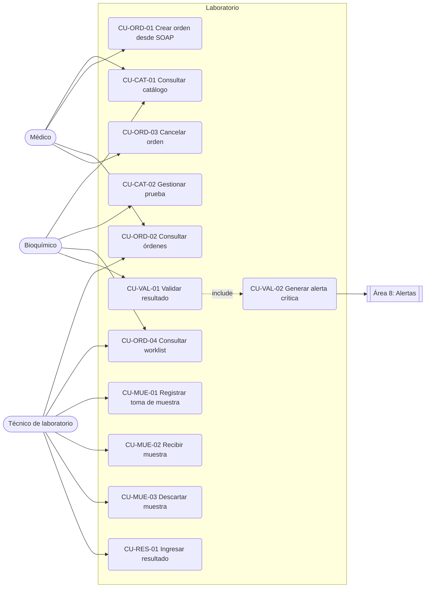
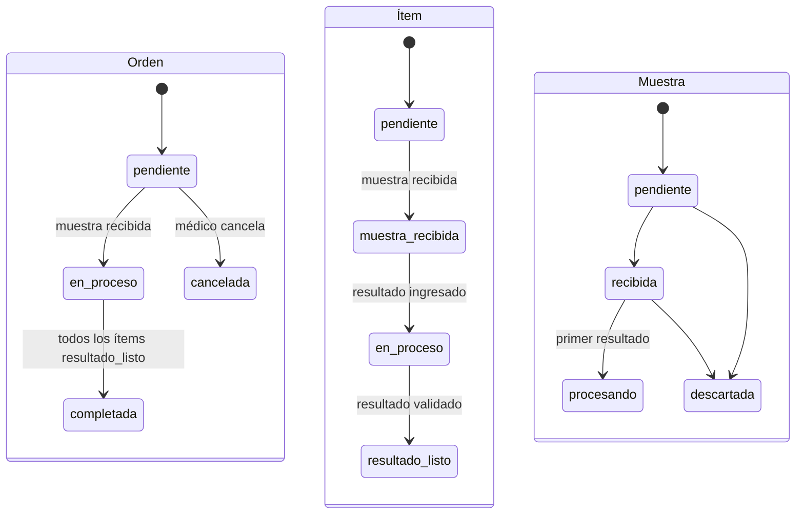

# ASII-07 - Laboratorio clínico

Responsable: Josué Hicho (`Jhos-hgnu`)  
Ramas: `feature/asii-07-laboratorio-<tema>-Jhos-hgnu` (una por fase, desde `develop`)  
Área asignada: laboratorio (órdenes, catálogo, muestras, resultados y validación)  
Módulos originales: 16, 17, 18, 19 y 20

Este documento cubre la **Fase 0** del área: análisis, requerimientos, reglas de negocio y
dependencias. Es la base de las fases de implementación (sección 12). Las vistas
arquitectónicas detalladas y el contrato API definitivo se entregan en un PR posterior.

## 1. Alcance del módulo

El área cubre el ciclo completo de un examen de laboratorio dentro de cada hospital: el
médico ordena exámenes desde una nota SOAP, el técnico toma y recibe la muestra, ingresa el
resultado, y el bioquímico lo valida. Si el valor está fuera del rango de pánico, se genera
una alerta crítica para el médico que ordenó.

Fuera de alcance del área:

- Crear notas SOAP, pacientes o expedientes (áreas 5 y 2).
- Mostrar, confirmar o reportar alertas críticas (área 8). Laboratorio solo las **genera**.
- Envío en tiempo real por websocket (área 8) y auditoría centralizada (área 1).
- Integración con analizadores o equipos de laboratorio externos.

## 2. Submódulos

El área absorbe cinco módulos que antes estaban repartidos. Cada requerimiento, caso de uso,
PR y prueba se etiqueta con el código del submódulo para conservar la trazabilidad.

| Código | Submódulo | Tablas | Actor principal | Permiso |
|---|---|---|---|---|
| CAT | Catálogo de pruebas | `lab_tests` | Bioquímico | `laboratorio.gestionar_catalogo` |
| ORD | Órdenes | `lab_orders`, `lab_order_items` | Médico | `laboratorio.ordenar` |
| MUE | Muestras | `samples` | Técnico de laboratorio | `laboratorio.recibir_muestra` |
| RES | Resultados | `lab_results` | Técnico de laboratorio | `laboratorio.ingresar_resultado` |
| VAL | Validación y alerta crítica | `lab_results`, `critical_alerts` | Bioquímico | `laboratorio.validar_resultado` |

Dependencia entre submódulos: **CAT → ORD → MUE → RES → VAL**. No se ordena sin catálogo,
no se recibe muestra sin orden, no se ingresa resultado sin muestra y no se valida sin resultado.

## 3. Actores y permisos

Permisos tomados de `database/seeders/RoleSeeder.php`. El área **no requiere permisos nuevos**.

| Rol | `ver` | `ordenar` | `recibir_muestra` | `ingresar_resultado` | `validar_resultado` | `gestionar_catalogo` |
|---|:-:|:-:|:-:|:-:|:-:|:-:|
| Admin | ✔ | ✔ | ✔ | ✔ | ✔ | ✔ |
| Médico | ✔ | ✔ | | | | |
| Enfermera | ✔ | | | | | |
| TecnicoLab | ✔ | | ✔ | ✔ | | |
| Bioquimico | ✔ | | | | ✔ | ✔ |
| Recepcionista | | | | | | |

Actores externos: **EMR / notas SOAP** (área 5, origen de la orden), **Alertas** (área 8,
consume `critical_alerts`) y **Auditoría** (área 1, recibe el registro de acciones clínicas).

## 4. Casos de uso

| Código | Caso de uso | Actor | Resultado esperado |
|---|---|---|---|
| CU-CAT-01 | Consultar catálogo | Médico, Bioquímico | Lista de pruebas activas con unidad, categoría y rangos. |
| CU-CAT-02 | Gestionar prueba | Bioquímico | Prueba creada, editada o desactivada (no se borra si tiene órdenes). |
| CU-ORD-01 | Crear orden desde SOAP | Médico | Orden `pendiente` con código único y una o más pruebas. |
| CU-ORD-02 | Consultar órdenes | Médico, Técnico | Órdenes filtradas por paciente, estado, prioridad o fecha. |
| CU-ORD-03 | Cancelar orden | Médico | Orden `cancelada`; solo si ninguna muestra fue recibida. |
| CU-ORD-04 | Consultar worklist | Técnico, Bioquímico | Órdenes abiertas ordenadas por prioridad (STAT, urgente, rutina) y antigüedad. |
| CU-MUE-01 | Registrar toma de muestra | Técnico | Muestra `pendiente` con código de barras único y tipo. |
| CU-MUE-02 | Recibir muestra | Técnico | Muestra `recibida`; los ítems de la orden pasan a `muestra_recibida`. |
| CU-MUE-03 | Descartar muestra | Técnico | Muestra `descartada` con motivo obligatorio. |
| CU-RES-01 | Ingresar resultado | Técnico | Resultado guardado y clasificado como normal, anormal o crítico. |
| CU-VAL-01 | Validar resultado | Bioquímico | Resultado validado; el ítem pasa a `resultado_listo`. |
| CU-VAL-02 | Generar alerta crítica | Sistema | Una única alerta `valor_critico_lab` para el médico que ordenó. |

## 5. Requerimientos funcionales

| Código | Requerimiento | Criterio de aceptación |
|---|---|---|
| RF-CAT-01 | Listar pruebas del catálogo con filtros por nombre, categoría y estado activo. | Solo devuelve pruebas del hospital actual; la búsqueda ignora mayúsculas y acentos. |
| RF-CAT-02 | Crear y editar pruebas con unidad, rangos de referencia, rangos críticos y tiempo estimado. | Nombre único por hospital; `reference_min ≤ reference_max`; los límites críticos quedan fuera del rango de referencia. |
| RF-CAT-03 | Desactivar pruebas sin borrarlas. | Una prueba inactiva no puede agregarse a órdenes nuevas; las órdenes previas no cambian. |
| RF-ORD-01 | Crear una orden a partir de una nota SOAP con una o más pruebas activas. | Paciente y expediente se toman de la nota; no se acepta la misma prueba dos veces en la orden. |
| RF-ORD-02 | Generar el código de orden automáticamente. | Formato `LAB-{PREFIJO}-{AAAA}{NNNN}`, único por hospital incluso con peticiones simultáneas. |
| RF-ORD-03 | Asignar prioridad `rutina`, `urgente` o `STAT`. | Un valor distinto responde 422, nunca 500. |
| RF-ORD-04 | Listar y ver el detalle de órdenes con paciente, pruebas, muestras y resultados. | Filtros por paciente, estado, prioridad y rango de fechas; sin consultas N+1. |
| RF-ORD-05 | Cancelar una orden. | Solo en estado `pendiente`; en otro estado responde 422 con el motivo. |
| RF-ORD-06 | Exponer la worklist del laboratorio. | Incluye órdenes `pendiente` y `en_proceso`; orden STAT → urgente → rutina, y luego `ordered_at` ascendente. |
| RF-MUE-01 | Registrar la toma de muestra con tipo y fecha de toma. | Genera código `BC-{PREFIJO}-{NNNNNN}` único por hospital; solo para órdenes no canceladas. |
| RF-MUE-02 | Recibir la muestra en laboratorio. | Registra `received_by` y `received_at`; ítems a `muestra_recibida`; la orden pasa a `en_proceso`. |
| RF-MUE-03 | Descartar una muestra. | Solo desde `pendiente` o `recibida`; el motivo en `notes` es obligatorio. |
| RF-RES-01 | Ingresar el resultado de un ítem, numérico o de texto. | Exige al menos uno de los dos valores y una muestra recibida de la misma orden. |
| RF-RES-02 | Clasificar automáticamente el resultado numérico. | `is_abnormal` e `is_critical` se calculan en el servidor con la regla de la sección 8.3; el cliente no los envía. |
| RF-VAL-01 | Validar un resultado ingresado. | Registra `validated_by` y `validated_at`; quien valida no puede ser quien ingresó. |
| RF-VAL-02 | Completar la orden automáticamente. | Cuando todos los ítems están en `resultado_listo`, la orden pasa a `completada`. |
| RF-VAL-03 | Generar la alerta crítica al validar un resultado crítico. | Se inserta una sola alerta `valor_critico_lab` dirigida a `ordered_by`, en la misma transacción que la validación. |

## 6. Requerimientos no funcionales

| Código | Requerimiento | Criterio de aceptación |
|---|---|---|
| RNF-LAB-01 | Seguridad por rol y permiso. | Toda ruta usa `['tenant', 'auth.jwt']` + `permission:laboratorio.*`; sin permiso responde 403. |
| RNF-LAB-02 | Aislamiento por hospital. | Los modelos usan `BelongsToTenant`; no se filtra `tenant_id` a mano. Un ID de otro hospital responde 404. |
| RNF-LAB-03 | Compatibilidad PostgreSQL. | Búsquedas con `whereSearch()`; enums validados con `Rule::in`; pruebas en verde con `phpunit.pgsql.xml`. |
| RNF-LAB-04 | Integridad transaccional. | Validación, cambios de estado y alerta crítica ocurren en una transacción: todo o nada. |
| RNF-LAB-05 | Trazabilidad clínica. | Crear/cancelar orden, recibir/descartar muestra e ingresar/validar resultado se registran en `audit_logs` con el servicio del área 1. |
| RNF-LAB-06 | Segregación de funciones. | Ingreso (TecnicoLab) y validación (Bioquimico) son permisos distintos y la regla de RF-VAL-01 se aplica en el servidor. |
| RNF-LAB-07 | Rendimiento de la worklist. | Usa el índice `idx_lab_orders_worklist` y carga relaciones con eager loading; listados paginados. |
| RNF-LAB-08 | Diseño mantenible. | Controllers delgados; la lógica vive en servicios (`LabOrderService`, `SampleService`, `CriticalValueEvaluator`) con pruebas unitarias. |
| RNF-LAB-09 | Datos sensibles. | Las respuestas no exponen datos del paciente que no necesita el rol; con `APP_DEBUG=false` no se filtran errores SQL. |

## 7. Criterios de aceptación de los flujos principales

**Flujo completo (ORD → MUE → RES → VAL)**  
Dado un médico con una nota SOAP del paciente,  
cuando crea una orden de glucosa, el técnico recibe la muestra e ingresa 95 mg/dL y el
bioquímico la valida,  
entonces la orden queda `completada`, el resultado no es anormal ni crítico y no se crea alerta.

**Valor crítico**  
Dado un resultado de potasio por encima de `critical_max`,  
cuando el bioquímico lo valida,  
entonces se crea exactamente una alerta `valor_critico_lab` para el médico que ordenó, y una
segunda validación responde 422 sin crear otra alerta.

**Aislamiento**  
Dado un técnico del Hospital A,  
cuando consulta una orden del Hospital B por su ID,  
entonces recibe 404 y no ve ningún dato de esa orden.

**Segregación**  
Dado un usuario con ambos permisos que ingresó un resultado,  
cuando intenta validar ese mismo resultado,  
entonces recibe 422 y el resultado sigue sin validar.

## 8. Reglas de negocio

### 8.1 Estados

Los valores salen de los enums de `2026_04_26_130000_create_laboratory_tables.php`. Cualquier
transición no dibujada responde 422.

### 8.2 Códigos

| Código | Formato | Ejemplo | Origen del prefijo |
|---|---|---|---|
| Orden | `LAB-{PREFIJO}-{AAAA}{NNNN}` | `LAB-SANMAR-20260001` | 6 primeros caracteres del slug del hospital |
| Muestra | `BC-{PREFIJO}-{NNNNNN}` | `BC-SANMAR-000001` | Igual que la orden |

Mismo formato que usa `DemoDataSeeder2026`. Caben en las columnas (`code` 20, `barcode` 50) y
la unicidad la garantizan `uq_lab_orders_tenant_code` y `uq_samples_tenant_barcode`. Ante una
colisión por concurrencia, el servicio reintenta con el siguiente número.

### 8.3 Clasificación de resultados

| Condición sobre `numeric_value` | `is_abnormal` | `is_critical` |
|---|:-:|:-:|
| Dentro de `[reference_min, reference_max]` (límites inclusive) | no | no |
| Fuera del rango de referencia | sí | no |
| `≤ critical_min` o `≥ critical_max` | sí | sí |
| Límite nulo | ese lado no se evalúa | ese lado no se evalúa |
| Solo `text_value` | no | no |

## 9. Principio SOLID aplicado

**Single Responsibility.** La clasificación de un resultado cambia por razones clínicas (rangos
nuevos), mientras que el guardado cambia por razones técnicas. Por eso la regla 8.3 vive en
`CriticalValueEvaluator`, una clase sin base de datos ni efectos secundarios, y
`LabResultService` solo la invoca y persiste. Así se prueba con pruebas unitarias puras.

**Dependency Inversion.** La validación no conoce cómo se notifica la alerta (eso es del área 8);
depende de un contrato pequeño para registrar la alerta crítica. Si el área 8 cambia la entrega
(websocket, correo), laboratorio no se modifica.

Fuente: `https://mvpcluster.com/diseno-de-software-2/`.

## 10. Dependencias con otras áreas

| Área | Punto de integración | Submódulo | Estado |
|---|---|---|---|
| 1 · María Lindo | Servicio común de auditoría; usuario demo con rol Bioquimico y órdenes en estados abiertos | Todos | En revisión: #9 → PR #14 (`AuditLogger`) |
| 2 · María de los Ángeles | Forma del objeto `patient` en las respuestas | ORD | Acordado en `contrato-api.md` §3; #13 → PR #16 (`PatientSummaryResource`) |
| 5 · Lis Rosales | `SoapNoteFactory`, relación `SoapNote::labOrders()`, política de borrado de notas y si la nota debe estar firmada | ORD | Pendiente: #11 |
| 8 · Cindy Ruano | Quién inserta y quién lee `critical_alerts`, formato de `message`, quién marca `sent_to_emr` | VAL | Pendiente: #12 |
| 9 · Axel Herrera | Formato de respuesta y paginación, C4 global, plantillas de PR e issue | Todos | Resuelto: #7 y #8 (`contrato-api.md`, `arquitectura-c4.md`) |

Ninguna dependencia bloquea F1. Las de las áreas 1 y 5 se necesitan desde F2 y la del área 8
en F4. La propuesta de cada una está en la sección 11.

## 11. Hallazgos y decisiones propuestas

| ID | Hallazgo en la base | Propuesta |
|---|---|---|
| H-01 | `LabOrder` y `LabResult` usan `HasFactory`, pero no existe su factory; `LabTest`, `LabOrderItem`, `Sample` y `CriticalAlert` no usan el trait. | Resuelto en F1: 6 factories y `HasFactory` en los 6 modelos. |
| H-02 | No existe `SoapNoteFactory` y `lab_orders.soap_note_id` es obligatorio. | Pedida al área 5 (#11); mientras tanto `LabOrderFactory` crea la nota con un `TODO(#11)`. |
| H-03 | Las factories actuales crean un hospital nuevo en cada nivel. | Resuelto en F1: las factories de laboratorio propagan un único `tenant_id` por toda la cadena (`LabFactoriesTest`). |
| H-04 | `lab_orders.soap_note_id` usa `cascadeOnDelete`: borrar una nota destruye orden, muestras y resultados. | `restrictOnDelete` o borrado lógico de notas (acordar con el área 5). |
| H-05 | El seeder valida resultados con el usuario Admin y solo evalúa `critical_max` (con `reference_max × 1.5` si es nulo). | Validar con Bioquimico y aplicar la regla 8.3 (área 1). |
| H-06 | El seeder deja todas las órdenes `completada` y sortea `acknowledged` y `acknowledged_at` por separado. | Incluir órdenes abiertas y alertas coherentes (área 1). |

## 12. Plan de fases

| Fase | Contenido | Submódulo |
|---|---|---|
| F0 | Este documento (solo documentación) · vista C4 de componentes y contrato API preliminar | Todos |
| F1 | 6 factories · catálogo: listar, ver, crear, editar y desactivar + pruebas de permisos, hospital, unicidad y rangos | CAT |
| F2 | `LabOrderService` (código, resolución SOAP) · crear, listar, ver y cancelar · worklist | ORD |
| F3 | `SampleService` (código de barras) · toma, recepción y descarte | MUE |
| F4 | `CriticalValueEvaluator` + pruebas unitarias · ingreso con clasificación · validación · alerta crítica transaccional | RES, VAL |
| F5 | UI Vue: catálogo, worklist y órdenes, recepción de muestras, ingreso y validación | Todos |
| F6 | Contrato API final, evidencia de integración y matriz de amenazas | Todos |

Reglas para cada PR: menos de 400 líneas, rama `feature/asii-07-laboratorio-<tema>-Jhos-hgnu`
desde `develop`, título `ASII-07: laboratorio - <tema> - Jhos-hgnu`, y `php artisan test`,
`php artisan test --configuration=phpunit.pgsql.xml` y `npm run build` en verde. Los archivos
compartidos (`routes/api.php`, `router/index.js`, `AppLayout.vue`) solo se tocan en el bloque
del área 7.

## 13. Avance

| Fecha | Avance | Evidencia |
|---|---|---|
| 2026-10-01 | Fase 0: análisis, submódulos, casos de uso, RF/RNF, criterios de aceptación, reglas de negocio, SOLID, dependencias y plan de fases. | Este documento. |
| 2026-10-05 | Fase 1 (parte 1): 6 factories de laboratorio con un solo hospital por cadena. | `LabFactoriesTest`. |
