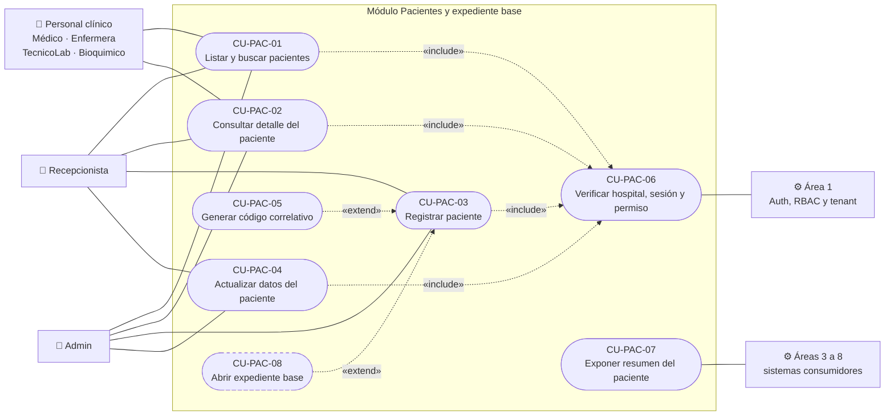
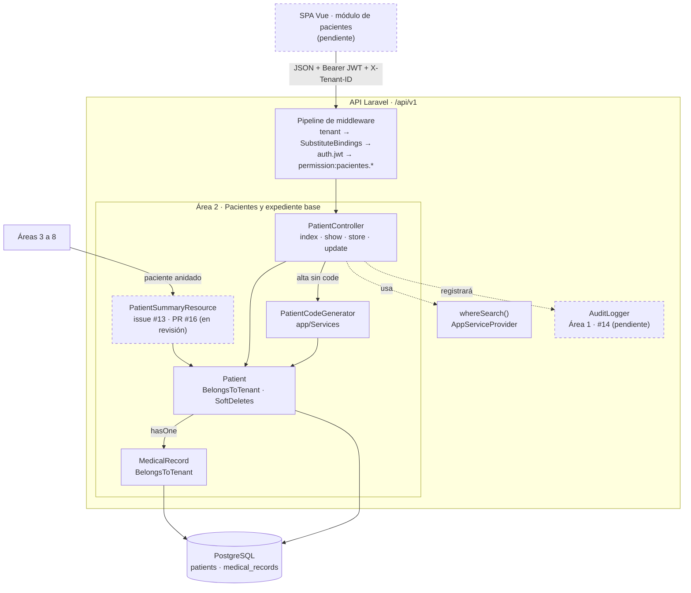
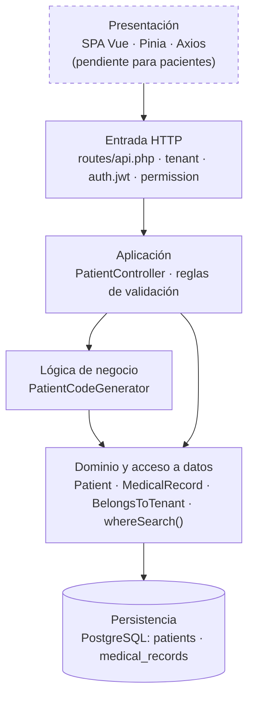
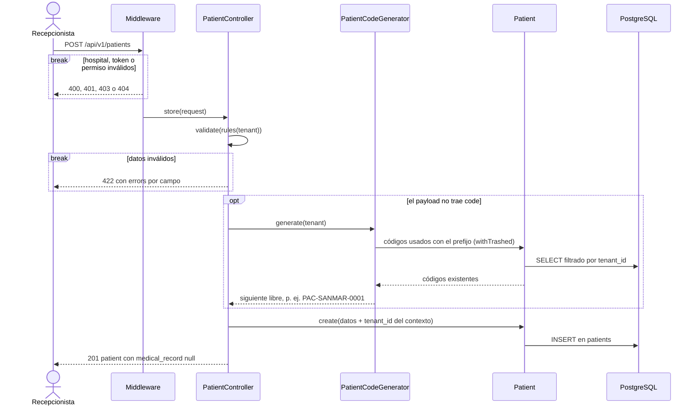

# ASII-02 - Pacientes y expediente base

Rama de trabajo: `feature/area-2-pacientes-expediente`
Base del PR: `develop`
Estado: **ETAPA 2 (backend Patient) implementada**. El expediente medico (`medical_records`) y la UI quedan para etapas posteriores.

Contenido: las secciones 1 a 10 documentan el contrato y la implementación del
backend. Las secciones 11 a 14 son los entregables de análisis y diseño de las
semanas 1 a 3 de [`weekly-plan.md`](weekly-plan.md):

| Semana | Entregable | Sección |
|---:|---|---|
| 1 | Actores y casos de uso (diagrama + narrativa) | [11](#11-actores-y-casos-de-uso) |
| 2 | Tabla RF/RNF con criterios de aceptación | [12](#12-requerimientos-y-criterios-de-aceptación) |
| 2 | Principio SOLID aplicado | [13](#13-principio-solid-aplicado) |
| 3 | Vista arquitectónica y por capas | [14](#14-vista-arquitectónica) |

## 1. Alcance

Este documento describe el contrato de la API de pacientes del Area 2. La etapa
actual cubre el CRUD de datos demograficos y la consulta del resumen de expediente
para saber si el paciente ya tiene expediente abierto.

Quedan fuera de esta etapa y se anadiran despues:

- Alta y edicion de `medical_records` (expediente clinico).
- Notas SOAP, diagnosticos y signos vitales (Area 5).
- Borrado logico de pacientes via API (el modelo ya tiene `SoftDeletes`, pero no se
  expone endpoint porque el flujo de baja pertenece al area de admisiones).
- Interfaz Vue / store Pinia.

## 2. Contrato API

Todas las rutas requieren la cabecera `X-Tenant-ID`. Las rutas privadas tambien
requieren `Authorization: Bearer <token>`.

| Metodo | Ruta | Permiso | Proposito |
|---|---|---|---|
| GET | `/api/v1/patients` | `pacientes.ver` | Listar y buscar pacientes. |
| POST | `/api/v1/patients` | `pacientes.crear` | Crear paciente. |
| GET | `/api/v1/patients/{patient}` | `pacientes.ver` | Detalle con resumen de expediente. |
| PUT | `/api/v1/patients/{patient}` | `pacientes.editar` | Actualizar paciente. |

No se implementa `DELETE`: el paciente se archiva logicamente desde el flujo de
admisiones del Area 4.

## 3. Campos del paciente

`code` es obligatorio en la base de datos, pero opcional en el payload: si no se
envia, la API lo genera. El resto de obligatorios y maximos vienen de la migracion
`create_admission_catalogs`.

| Campo | Tipo | Regla | Columna |
|---|---|---|---|
| `tenant_id` | uuid | **No se acepta del cliente.** Se toma de `X-Tenant-ID`. | `foreignUuid` |
| `code` | string | opcional, max 20, unico por hospital | `string(20)` |
| `first_name` | string | requerido, max 100 | `string(100)` |
| `last_name` | string | requerido, max 100 | `string(100)` |
| `birth_date` | date | requerido, `1900-01-01` a hoy | `date` |
| `gender` | enum | requerido: `M`, `F`, `otro` | `enum` |
| `dpi` | string | opcional, max 20, 13 digitos (`/^\d{13}$/`) | `string(20)` |
| `nit` | string | opcional, max 20 | `string(20)` |
| `phone` | string | opcional, max 20 | `string(20)` |
| `email` | string | opcional, email valido, max 150 | `string(150)` |
| `address` | string | opcional, max 200 | `string(200)` |
| `insurance_company` | string | opcional, max 100 | `string(100)` |
| `insurance_policy` | string | opcional, max 50 | `string(50)` |
| `emergency_contact_name` | string | opcional, max 100 | `string(100)` |
| `emergency_contact_phone` | string | opcional, max 20 | `string(20)` |
| `blood_type` | enum | opcional: `A+ A- B+ B- O+ O- AB+ AB-` | `enum` |
| `notes` | text | opcional, max 2000 (limite de negocio, la columna es `text`) | `text` |

Ejemplo de payload de alta:

```json
{
  "first_name": "Ana",
  "last_name": "Rios",
  "birth_date": "1992-03-08",
  "gender": "F",
  "dpi": "9999999999999",
  "phone": "5555-1111",
  "email": "ana@demo.local",
  "blood_type": "O+"
}
```

`PUT` es reemplazo completo: `first_name`, `last_name`, `birth_date` y `gender` son
obligatorios tambien al editar. Los campos opcionales que no se envien conservan su
valor actual (no se borran por omision). Enviar `code` es opcional; si se omite, el
codigo no cambia.

## 4. Respuestas

`GET /api/v1/patients` devuelve el **paginador nativo de Laravel**, igual que
`GET /api/v1/doctors`. IMPORTANTE: el paginador nativo **no anida la metadata bajo
`meta`**; la expone en la raiz. El store de Pinia debe leer `data` para los items y
`total` / `per_page` / `last_page` para la paginacion.

```json
{
  "current_page": 1,
  "data": [ { "id": 1, "code": "PAC-SANMAR-0001", "first_name": "Ana", "medical_record": null } ],
  "first_page_url": "http://localhost/api/v1/patients?page=1",
  "from": 1,
  "last_page": 2,
  "last_page_url": "http://localhost/api/v1/patients?page=2",
  "links": { "first": null, "last": "...", "prev": null, "next": "..." },
  "next_page_url": "http://localhost/api/v1/patients?page=2",
  "path": "http://localhost/api/v1/patients",
  "per_page": 15,
  "prev_page_url": null,
  "to": 15,
  "total": 20
}
```

`GET`, `POST` y `PUT` de un paciente devuelven el modelo envuelto en `patient`:

```json
{ "patient": { "id": 1, "code": "PAC-SANMAR-0001", "medical_record": null } }
```

`medical_record` es un **resumen** (`id`, `tenant_id`, `patient_id`,
`record_number`, `opened_at`) o `null` si el paciente aun no tiene expediente. No se
cargan los antecedentes ni los signos vitales: `Patient::vitalSigns()` es un
`hasManyThrough` con `orderByDesc`, y contar sobre esa relacion falla en PostgreSQL.

Codigos de estado: `200` en listado, detalle y actualizacion; `201` en alta; `401`
sin token; `403` sin permiso o con un token de otro hospital; `404` si el paciente
no existe, esta borrado logicamente o pertenece a otro hospital; `422` con
`errors` por campo en fallos de validacion.

## 5. Parametros del listado

| Parametro | Por defecto | Valores | Descripcion |
|---|---|---|---|
| `search` | - | texto | Busca en `first_name`, `last_name`, `dpi`, `code` y `phone`. |
| `q` | - | texto | Alias de `search` (mismo criterio que medicos y citas). |
| `per_page` | 15 | 1 a 50 | Se limita a 50 aunque se pida mas. |
| `sort_by` | `last_name` | `last_name`, `first_name`, `code`, `birth_date`, `created_at` | Lista blanca; un valor no permitido cae al valor por defecto. |
| `sort_dir` | `asc` | `asc`, `desc` | Cualquier otro valor se trata como `asc`. |
| `page` | 1 | entero | Pagina solicitada. |

`sort_by` y `sort_dir` no se interpolan en el SQL: solo se acepta un valor de la
lista blanca. Se anade `id` como segundo criterio de orden para que dos apellidos
iguales no se repitan ni se salten al paginar.

La busqueda usa el macro `whereSearch()` de `AppServiceProvider`: en PostgreSQL
ignora mayusculas y acentos (`unaccent` + `ILIKE`), en SQLite ignora mayusculas. Por
eso `search=lopez` encuentra `López` solo en PostgreSQL; en la suite SQLite esa
prueba se omite. Los comodines `%`, `_` y `\` del texto buscado se escapan, de modo
que no actuan como comodines.

## 6. Generacion del codigo

`app/Services/PatientCodeGenerator.php` genera `PAC-{PREFIJO}-{0001}`:

- El prefijo son los primeros 6 caracteres alfanumericos del `slug` del hospital en
  mayusculas (`san-marcos` -> `SANMAR`), igual que el seeder de demo, para que los
  codigos de dos hospitales nunca se parezcan. El largo total es 15 caracteres, dentro
  del `string(20)`.
- El correlativo es el maximo ya usado con ese prefijo, mas uno.
- La busqueda del maximo usa `withTrashed()`: la restriccion `uq_patients_tenant_code`
  es dura y un paciente borrado logicamente sigue ocupando su codigo. Ademas hay un
  bucle `do/while` que descarta codigos ocupados, para no chocar con codigos
  manuales ya existentes.
- Si el cliente envia `code`, se respeta el suyo, validado con `Rule::unique` acotado
  al hospital de la peticion.
- No se filtra `tenant_id` a mano en el servicio: el global scope de
  `BelongsToTenant` ya acota la consulta al hospital de la peticion.

## 7. Aislamiento por hospital (tenant)

Defensa en cuatro capas:

1. **Global scope.** `Patient` usa el trait `BelongsToTenant`; toda consulta anade
   `where tenant_id = <X-Tenant-ID>`. No se escribe `tenant_id` a mano en el
   controlador ni en el generador de codigos.
2. **`tenant_id` no es un campo aceptable.** No esta en las reglas de validacion, y
   `validate()` devuelve solo las claves declaradas. Un `tenant_id` enviado en el alta
   se descarta y se reemplaza por el del contexto; en la edicion se ignora. Hay dos
   pruebas que lo verifican.
3. **El modelo se resuelve con el hospital ya conocido.** `show` y `update`
   reciben el id y lo resuelven con `Patient::query()->findOrFail($id)` dentro del
   controller, cuando `currentTenant` ya existe. Un paciente de otro hospital no
   resuelve y responde 404, sin confirmar que existe. Esta decisión se tomó cuando
   `SubstituteBindings` (grupo `api`) corría **antes** del middleware `tenant` y el
   binding implícito resolvía el modelo sin global scope. Desde el PR #17 ya no es
   así: `bootstrap/app.php` antepone `TenantMiddleware` a `SubstituteBindings`
   (`prependToPriorityList`), de modo que el binding implícito también respeta el
   hospital. Seguir con `findOrFail` es válido y equivalente (ver sección 10).
4. **Token contra cabecera.** El middleware `auth.jwt` valida que el token pertenezca
   al hospital de `X-Tenant-ID`; si no, responde 403.

## 8. Permisos

| Permiso | Uso | Roles que lo tienen |
|---|---|---|
| `pacientes.ver` | listado y detalle | Admin, Médico, Enfermera, Recepcionista, TecnicoLab, Bioquimico |
| `pacientes.crear` | alta | Admin, Recepcionista |
| `pacientes.editar` | edicion | Admin, Recepcionista |

Definidos en `database/seeders/RoleSeeder.php`. No se modifico ese archivo. El
expediente usara `expediente.editar` (no existe `expediente.crear`); la apertura del
expediente se disparara junto con la creacion del paciente en una etapa posterior.

## 9. Pruebas

`tests/Feature/PatientTest.php`, 45 pruebas contra la API real:

- Listado: contenido del hospital, orden por defecto (`last_name` asc), orden
  descendente, columna no permitida, paginacion, tope de `per_page`.
- Busqueda: sin distincion de mayusculas, alias `q`, busqueda por apellido, `dpi`,
  `code` y telefono, acentos en PostgreSQL (se omite en SQLite), busqueda vacia.
- Detalle: resumen de expediente, `null` sin expediente, expediente de otro hospital
  oculto, 404 por id inexistente y por paciente borrado logicamente.
- Alta: recepcionista crea, generacion de codigo correlativo, codigo distinto por
  paciente, no reutiliza codigo de borrado logico, reanuda secuencia tras codigo
  manual, acepta codigo explicito, rechaza duplicado en el mismo hospital y lo
  permite en otro.
- Validaciones: campos obligatorios, fecha futura, `gender` y `blood_type` fuera del
  enum, `dpi` y `email` malformados, valores mas largos que la columna.
- Edicion: recepcionista actualiza, conserva el codigo si no se envia, acepta su
  propio codigo, rechaza el de otro paciente del mismo hospital, exige los
  obligatorios, 404 por id inexistente.
- Autorizacion: 401 sin token, 403 sin rol, Enfermera lee pero no escribe, Admin
  escribe, token de otro hospital rechazado.
- Aislamiento: listado y busqueda no filtran otros hospitales, detalle y edicion dan
  404 para un paciente ajeno, `tenant_id` del cliente ignorado en alta y edicion.

Comandos:

```powershell
php artisan test --filter=PatientTest
php artisan test
php artisan route:list --path=api/v1/patients
```

Resultado: 44 pruebas pasan, 1 se omite (busqueda sin acentos, solo aplica en
PostgreSQL). Suite completa: 65 pasan, 1 se omite. Estas cifras son las del PR
del backend; desde entonces `develop` sumó pruebas de otras áreas (PR #17 y
contrato de errores), así que el total de la suite completa hoy es mayor.

## 10. Pendientes y riesgos

- **Resuelto en el PR #17: binding implícito y tenant.** El riesgo que aquí se
  reportaba para `{doctor}` y `{appointment}` del Área 3 ya no existe.
  `bootstrap/app.php` usa `prependToPriorityList` para que `TenantMiddleware` corra
  antes que `SubstituteBindings`, así que el binding implícito de cualquier área se
  resuelve con el global scope activo y un id de otro hospital responde 404. Lo
  cubren `test_appointment_routes_return_404_for_an_appointment_of_another_tenant`
  y `test_doctor_and_specialty_updates_return_404_for_records_of_another_tenant`
  en `tests/Feature/TenantIsolationTest.php`.
- **`findOrFail` en `PatientController` (opcional).** El Área 2 sigue resolviendo
  `{patient}` por id dentro del controller. Es válido y da el mismo resultado que
  el binding implícito; migrar `show`/`update` a `Patient $patient` sería solo
  una simplificación, no una corrección. Si se hace, las dos pruebas
  `test_show_and_update_return_404_for_a_patient_of_another_tenant` y
  `test_show_returns_404_for_a_soft_deleted_patient` deben seguir en verde.
- **Auditoria.** No se creo `AuditLogger` ni se escribieron eventos de auditoria en
  altas y ediciones. Queda pendiente enganchar el servicio de auditoria del Area 1
  (`audit_logs`) en `store` y `update`.
- **Apertura de expediente.** Hoy `POST /patients` no crea `medical_records`; la
  respuesta incluye `medical_record: null` para que la UI sepa que falta abrirlo.
  Definir si se abre automaticamente al dar de alta al paciente.
- **Validar en PostgreSQL.** La prueba de acentos se omite en SQLite. Correr
  `php artisan test --configuration=phpunit.pgsql.xml` antes del PR.
- **`notes` con limite de 2000 caracteres.** La columna es `text` sin tope; el limite
  viene de la regla de validacion. Si el negocio necesita mas, hay que subir la regla.
- **Sin endpoint de baja.** El modelo tiene `SoftDeletes` pero no hay ruta `DELETE`;
  falta definir que rol archiva un paciente y que pasa con su expediente.
- **Sin UI.** No hay pantallas Vue ni store Pinia de pacientes;Area 3 ya tiene
  selectores de pacientes pendientes de estos endpoints.

## 11. Actores y casos de uso

Entregable de la semana 1. Describe quién usa el módulo, qué puede hacer y dónde
termina su responsabilidad dentro del HIS.

### 11.1 Límites del módulo

El Área 2 es dueña de la **identidad del paciente** dentro de cada hospital: sus
datos demográficos, su código y la referencia a su expediente. Todo lo clínico
que cuelga del paciente (citas, admisiones, notas SOAP, alergias, laboratorio)
pertenece a otras áreas, que solo necesitan el `patient_id` y un resumen del
paciente.

### 11.2 Actores

Roles y permisos tomados de `database/seeders/RoleSeeder.php`. El módulo no
requiere permisos nuevos.

| Actor | Tipo | `pacientes.ver` | `pacientes.crear` | `pacientes.editar` | Qué hace en el módulo |
|---|---|:-:|:-:|:-:|---|
| Recepcionista | Principal | ✔ | ✔ | ✔ | Registra al paciente en su primera visita, lo busca y mantiene sus datos. |
| Admin | Principal | ✔ | ✔ | ✔ | Lo mismo que recepción; tiene todos los permisos del hospital. |
| Médico | Consulta | ✔ | | | Busca al paciente y revisa sus datos y si ya tiene expediente. |
| Enfermera | Consulta | ✔ | | | Identifica al paciente antes de registrar signos vitales o alergias. |
| TecnicoLab | Consulta | ✔ | | | Identifica al paciente de una orden o muestra. |
| Bioquimico | Consulta | ✔ | | | Identifica al paciente de un resultado que valida. |
| Área 1 (Auth, RBAC y tenant) | Sistema de apoyo | | | | Resuelve el hospital, autentica el token y comprueba el permiso antes de cada caso de uso. |
| Áreas 3 a 8 | Sistemas consumidores | | | | Referencian al paciente por `patient_id` y lo muestran anidado en sus respuestas. |

El **paciente** no es usuario del sistema en esta versión: es el sujeto de los
datos, no un actor.

### 11.3 Diagrama de casos de uso



Notación: los actores principales están a la izquierda y los sistemas de apoyo a
la derecha, fuera del límite del módulo; los óvalos son casos de uso; las
flechas punteadas son relaciones «include» y «extend». El borde punteado del
CU-PAC-08 indica que está planificado y aún no implementado. Mermaid no tiene un
tipo de diagrama de casos de uso, por eso se dibuja como `flowchart` con la
notación UML.

| Código | Caso de uso | Actor | Endpoint | Resultado esperado | Estado |
|---|---|---|---|---|---|
| CU-PAC-01 | Listar y buscar pacientes | Todos los roles con `pacientes.ver` | `GET /api/v1/patients` | Página de pacientes del hospital, filtrada y ordenada. | Implementado |
| CU-PAC-02 | Consultar detalle del paciente | Todos los roles con `pacientes.ver` | `GET /api/v1/patients/{patient}` | Datos del paciente con el resumen de su expediente o `null`. | Implementado |
| CU-PAC-03 | Registrar paciente | Recepcionista, Admin | `POST /api/v1/patients` | Paciente creado en el hospital de la petición, con código único. | Implementado |
| CU-PAC-04 | Actualizar datos del paciente | Recepcionista, Admin | `PUT /api/v1/patients/{patient}` | Datos actualizados sin cambiar de hospital. | Implementado |
| CU-PAC-05 | Generar código correlativo | Sistema | (interno, extiende CU-PAC-03) | Código `PAC-{PREFIJO}-{0001}` cuando el cliente no envía uno. | Implementado |
| CU-PAC-06 | Verificar hospital, sesión y permiso | Área 1 | (middleware, incluido en CU-PAC-01 a 04) | La petición llega al módulo solo con hospital, token y permiso válidos. | Implementado |
| CU-PAC-07 | Exponer resumen del paciente | Áreas 3 a 8 | `PatientSummaryResource` | Objeto mínimo `id`, `code`, `first_name`, `last_name`, `birth_date`, `gender`. | En revisión (issue #13, PR #16) |
| CU-PAC-08 | Abrir expediente base | Sistema o Recepcionista (por definir) | Por definir | Registro en `medical_records` asociado al paciente. | Planificado |

Fuera del alcance del área: archivar (baja lógica) al paciente, que pertenece al
flujo de admisiones del Área 4, y todo el contenido clínico del expediente
(Área 5 en adelante).

### 11.4 Narrativa de los casos de uso

**Precondición común (CU-PAC-06).** La petición trae `X-Tenant-ID` con el UUID
de un hospital existente y un token JWT de un usuario de ese mismo hospital con
el permiso de la ruta. Si falla, el caso de uso no inicia:

| Situación | Respuesta |
|---|---|
| Falta `X-Tenant-ID` o no es un UUID | `400` |
| El hospital no existe | `404` |
| Sin token, token inválido o vencido | `401` |
| El token es de otro hospital, o el usuario no tiene el permiso | `403` |

**CU-PAC-01 · Listar y buscar pacientes**

- Actor: cualquier rol con `pacientes.ver`.
- Flujo principal:
  1. El actor abre el listado y, si quiere, escribe un texto de búsqueda y elige
     orden y tamaño de página.
  2. El sistema busca el texto en nombre, apellido, DPI, código y teléfono, solo
     entre los pacientes del hospital de la petición.
  3. Ordena por apellido ascendente y pagina de 15 en 15.
  4. Devuelve la página; cada paciente incluye el resumen de su expediente o
     `null` si aún no tiene.
- Flujos alternos:
  - Sin texto de búsqueda: se listan todos los pacientes del hospital.
  - `sort_by` fuera de la lista permitida: se usa el orden por defecto.
  - `per_page` mayor que 50: se limita a 50.
- Postcondición: no se modifica ningún dato.

**CU-PAC-02 · Consultar detalle del paciente**

- Actor: cualquier rol con `pacientes.ver`.
- Flujo principal:
  1. El actor selecciona un paciente del listado.
  2. El sistema lo busca por id dentro del hospital de la petición.
  3. Devuelve sus datos envueltos en `patient`, con `medical_record` como resumen
     (`id`, `tenant_id`, `patient_id`, `record_number`, `opened_at`) o `null`.
- Excepción: si el id no existe, el paciente fue borrado lógicamente o pertenece
  a otro hospital, responde `404` con el mismo mensaje en los tres casos, para no
  confirmar que el paciente existe.
- Postcondición: no se modifica ningún dato.

**CU-PAC-03 · Registrar paciente**

- Actor: Recepcionista o Admin (`pacientes.crear`).
- Flujo principal:
  1. El actor captura nombre, apellido, fecha de nacimiento y género, y los
     datos opcionales que tenga (DPI, NIT, teléfono, correo, dirección, seguro,
     contacto de emergencia, tipo de sangre, notas).
  2. El sistema valida los datos contra las reglas de la sección 3.
  3. Como el payload no trae `code`, el sistema genera el siguiente correlativo
     del hospital (CU-PAC-05).
  4. El sistema asigna el hospital de la petición como `tenant_id`.
  5. Guarda el paciente y responde `201` con `patient` y `medical_record: null`.
- Flujos alternos:
  - El actor envía un `code` propio: se respeta si no está usado en el hospital.
  - El payload trae `tenant_id`: se descarta y se usa el del contexto.
- Excepción: datos inválidos responden `422` con `errors` por campo (obligatorio
  ausente, fecha futura o anterior a 1900, género o tipo de sangre fuera del
  catálogo, DPI que no tiene 13 dígitos, correo mal formado, texto más largo que
  la columna, código ya usado en el hospital). No se guarda nada.
- Postcondición: el paciente existe en el hospital con un código único y todavía
  sin expediente.

**CU-PAC-04 · Actualizar datos del paciente**

- Actor: Recepcionista o Admin (`pacientes.editar`).
- Flujo principal:
  1. El actor abre el paciente, cambia los datos y guarda.
  2. El sistema busca el paciente por id dentro del hospital de la petición.
  3. Valida con las mismas reglas del alta; el código se compara contra los
     demás pacientes del hospital, sin contar al propio.
  4. Actualiza y responde `200` con el paciente actualizado.
- Flujos alternos:
  - No se envía `code`: el código actual se conserva.
  - Se omite un campo opcional: conserva su valor (no se borra por omisión).
  - El payload trae `tenant_id`: se ignora; el paciente no cambia de hospital.
- Excepciones: `404` si el paciente no existe en el hospital; `422` si los datos
  son inválidos o faltan los obligatorios.
- Postcondición: los datos quedan actualizados; el `tenant_id` y, salvo que se
  envíe otro, el código no cambian.

**CU-PAC-05 · Generar código correlativo**

- Actor: sistema (`PatientCodeGenerator`), solo cuando el alta no trae `code`.
- Flujo principal:
  1. Toma los primeros 6 caracteres alfanuméricos del `slug` del hospital, en
     mayúsculas, como prefijo (`san-marcos` → `SANMAR`).
  2. Busca el correlativo más alto ya usado con ese prefijo en el hospital,
     contando también a los pacientes borrados lógicamente.
  3. Suma uno y arma `PAC-{PREFIJO}-{0001}`; si ese código ya está ocupado,
     prueba con el siguiente.
- Postcondición: devuelve un código libre dentro del hospital.

**CU-PAC-07 · Exponer resumen del paciente**

- Actor: otra área que incluye al paciente en su respuesta (cita, admisión,
  orden de laboratorio).
- Resultado: el paciente anidado tiene siempre la misma forma mínima acordada en
  el issue #13, sin envoltorio `data`, como define
  [`contrato-api.md`](contrato-api.md).

## 12. Requerimientos y criterios de aceptación

Entregable de la semana 2. Cada requerimiento indica el caso de uso que
satisface, un criterio de aceptación comprobable y la prueba automatizada que
lo demuestra. Salvo que se indique otro archivo, las pruebas están en
`tests/Feature/PatientTest.php`.

### 12.1 Requerimientos funcionales

| Código | CU | Requerimiento | Criterio de aceptación | Evidencia |
|---|---|---|---|---|
| RF-PAC-01 | 01 | Listar los pacientes del hospital de forma paginada. | Responde `200` con el paginador de Laravel; solo incluye pacientes del `X-Tenant-ID`; 15 por página por defecto y un máximo de 50 aunque se pida más. | `test_list_returns_the_patients_of_the_current_tenant`, `test_list_paginates_and_reports_the_page_meta`, `test_list_caps_per_page_at_fifty` |
| RF-PAC-02 | 01 | Buscar pacientes por texto libre. | `search` (o su alias `q`) busca en nombre, apellido, DPI, código y teléfono sin distinguir mayúsculas; en PostgreSQL tampoco distingue acentos; la búsqueda vacía devuelve todos. | `test_search_ignores_case`, `test_search_accepts_both_search_and_q_parameters`, `test_search_matches_last_name_dpi_code_and_phone`, `test_search_ignores_accents_on_postgres`, `test_empty_search_returns_every_patient` |
| RF-PAC-03 | 01 | Ordenar el listado. | Orden por defecto `last_name` ascendente; `sort_by` acepta solo `last_name`, `first_name`, `code`, `birth_date` y `created_at`; un valor distinto no produce error y cae al orden por defecto. | `test_list_sorts_by_last_name_ascending_by_default`, `test_list_can_sort_by_another_column_descending`, `test_list_ignores_an_unknown_sort_column` |
| RF-PAC-04 | 02 | Consultar el detalle de un paciente con el resumen de su expediente. | Responde `200` con `patient`; `medical_record` trae `id`, `tenant_id`, `patient_id`, `record_number` y `opened_at`, o `null` si no hay expediente; un id inexistente o borrado lógicamente responde `404`. | `test_show_returns_the_patient_with_the_medical_record_summary`, `test_show_returns_null_medical_record_when_the_patient_has_none`, `test_show_returns_404_for_an_unknown_patient`, `test_show_returns_404_for_a_soft_deleted_patient` |
| RF-PAC-05 | 03 | Registrar un paciente con sus datos demográficos. | Con nombre, apellido, fecha de nacimiento y género válidos responde `201` con `patient` y lo guarda en el hospital de la petición. | `test_receptionist_can_create_a_patient` |
| RF-PAC-06 | 03, 04 | Validar los datos antes de guardar. | Responde `422` con `errors` por campo y no guarda nada si falta un obligatorio, la fecha es futura, `gender` o `blood_type` no están en el catálogo, el DPI no tiene 13 dígitos, el correo es inválido o un texto supera el largo de su columna. | `test_create_rejects_missing_required_data`, `test_create_rejects_a_future_birth_date`, `test_create_rejects_gender_outside_the_database_enum`, `test_create_rejects_blood_type_outside_the_database_enum`, `test_create_rejects_a_malformed_dpi_and_email`, `test_create_rejects_values_longer_than_the_column`, `test_update_rejects_missing_required_data` |
| RF-PAC-07 | 05 | Generar el código del paciente cuando el cliente no lo envía. | Formato `PAC-{PREFIJO}-{0001}`; cada alta recibe un correlativo distinto; no se reutiliza el código de un paciente borrado lógicamente; la secuencia continúa después de un código manual. | `test_create_generates_a_correlative_code_when_none_is_sent`, `test_create_generates_a_different_code_for_each_patient`, `test_create_never_reuses_the_code_of_a_soft_deleted_patient`, `test_create_resumes_the_sequence_after_a_manual_code` |
| RF-PAC-08 | 03 | Aceptar un código enviado por el cliente. | Se guarda tal cual si no existe en el hospital; si ya existe en el mismo hospital responde `422`; el mismo código en otro hospital sí se permite. | `test_create_accepts_an_explicit_code`, `test_create_rejects_a_code_already_used_in_the_same_tenant`, `test_create_allows_the_same_code_in_another_tenant` |
| RF-PAC-09 | 04 | Actualizar los datos de un paciente. | Responde `200` con el paciente actualizado; si no se envía `code` se conserva; puede reenviar su propio código; el código de otro paciente del hospital responde `422`; un id inexistente responde `404`. | `test_receptionist_can_update_a_patient`, `test_update_keeps_the_code_when_it_is_not_sent`, `test_update_accepts_keeping_its_own_code`, `test_update_rejects_a_code_used_by_another_patient_of_the_same_tenant`, `test_update_returns_404_for_an_unknown_patient` |
| RF-PAC-10 | 07 | Exponer el paciente con una forma mínima y estable para las demás áreas. | `PatientSummaryResource` devuelve exactamente `id`, `code`, `first_name`, `last_name`, `birth_date` y `gender`, sin envoltorio `data` cuando va anidado. | En revisión: issue #13, PR #16 (aún no está en `develop`) |

Requerimientos planificados, todavía sin implementación ni prueba:

| Código | CU | Requerimiento | Criterio de aceptación propuesto | Depende de |
|---|---|---|---|---|
| RF-PAC-11 | 08 | Abrir el expediente base del paciente. | Tras abrirlo, `GET /patients/{patient}` devuelve `medical_record` con `record_number` único por hospital; un paciente tiene como máximo un expediente. | Definir si se abre automáticamente en el alta (sección 10). |
| RF-PAC-12 | 01 a 04 | Pantallas de listado, alta y edición en la SPA. | El listado pagina y busca contra la API; los formularios muestran los `errors` del `422` junto a cada campo; las acciones de crear y editar solo se muestran con el permiso correspondiente. | Módulo Vue y store Pinia de pacientes. |

### 12.2 Requerimientos no funcionales

| Código | Atributo | Requerimiento | Criterio de aceptación | Evidencia |
|---|---|---|---|---|
| RNF-PAC-01 | Seguridad | Toda ruta exige autenticación y un permiso específico. | Las cuatro rutas usan `['tenant', 'auth.jwt']` más `permission:pacientes.*`; sin token responden `401`; sin el permiso, `403`; Enfermera puede leer pero no crear ni editar. | `test_all_patient_endpoints_require_authentication`, `test_user_without_any_role_cannot_reach_patients`, `test_nurse_can_read_but_cannot_create_or_update_patients`, `test_admin_can_create_and_update_patients` |
| RNF-PAC-02 | Aislamiento por hospital | Ningún dato de un hospital es visible ni modificable desde otro. | Listado y búsqueda no devuelven pacientes ajenos; detalle y edición de un paciente ajeno responden `404` y no lo modifican; un token de otro hospital responde `403`; el `tenant_id` enviado por el cliente se ignora en alta y edición. | `test_list_and_search_do_not_leak_patients_of_another_tenant`, `test_show_and_update_return_404_for_a_patient_of_another_tenant`, `test_show_hides_a_medical_record_belonging_to_another_tenant`, `test_token_from_another_tenant_is_rejected`, `test_create_ignores_a_tenant_id_sent_by_the_client`, `test_update_ignores_a_tenant_id_sent_by_the_client`; `tests/Feature/TenantIsolationTest.php` |
| RNF-PAC-03 | Confidencialidad | La API no confirma la existencia de registros a los que el usuario no tiene acceso. | Un id inexistente, borrado lógicamente o de otro hospital responde el mismo `404` con `Recurso no encontrado.`, sin nombres de clases ni SQL. | `test_unknown_and_foreign_records_return_the_same_generic_404` en `tests/Feature/ApiErrorFormatTest.php`; manejador de `NotFoundHttpException` en `bootstrap/app.php` |
| RNF-PAC-04 | Seguridad de entrada | Ningún dato del cliente llega sin filtrar al SQL ni al modelo. | El orden se elige de una lista blanca y nunca se interpola; los comodines `%`, `_` y `\` de la búsqueda se escapan; solo se guardan las claves declaradas en las reglas de validación. | `test_list_ignores_an_unknown_sort_column`; pruebas de `tenant_id` de RNF-PAC-02; escape de comodines en el macro `whereSearch()` de `AppServiceProvider` (revisión de código, sin prueba dedicada) |
| RNF-PAC-05 | Integridad | El código del paciente es único dentro de cada hospital. | La restricción `uq_patients_tenant_code` lo garantiza en la base de datos y la validación lo detecta antes con un `422`; las reglas de longitud y los catálogos coinciden con las columnas y enums de la migración. | Pruebas de RF-PAC-07 y RF-PAC-08; `test_create_rejects_values_longer_than_the_column` |
| RNF-PAC-06 | Portabilidad | El módulo se comporta igual en SQLite (pruebas locales) y PostgreSQL (producción). | La búsqueda usa `whereSearch()`; los enums se validan con `Rule::in`; la suite pasa con `phpunit.xml` y con `phpunit.pgsql.xml`. | `php artisan test` y `php artisan test --configuration=phpunit.pgsql.xml` |
| RNF-PAC-07 | Rendimiento | El listado no crece con el número de pacientes ni hace consultas por fila. | Paginación obligatoria con tope de 50; el resumen de expediente se carga con eager loading y solo cinco columnas; el filtro por hospital y el orden por defecto (`last_name`) se apoyan en `idx_patients_tenant_name`. Límite conocido: la búsqueda usa `%texto%`, que no aprovecha índices B-tree; es aceptable con la paginación actual y, si el volumen crece, la mejora es un índice trigram (`pg_trgm`). | `test_list_caps_per_page_at_fifty`; `PatientController::index`; migración `create_admission_catalogs` |
| RNF-PAC-08 | Consistencia | Las respuestas siguen el contrato común de la API. | Listados con el paginador de Laravel; recurso individual envuelto en `patient`; `201` al crear y `200` en lo demás; errores `422` con `message` y `errors` en español. | [`contrato-api.md`](contrato-api.md); `test_validation_errors_are_in_spanish_with_readable_field_names` en `tests/Feature/ApiErrorFormatTest.php` |
| RNF-PAC-09 | Mantenibilidad | El controller es delgado y la regla de negocio propia del módulo vive en un servicio. | La generación del código está en `PatientCodeGenerator` y se puede cambiar sin tocar el controller (sección 13); el código pasa Pint. | `app/Services/PatientCodeGenerator.php`; `vendor/bin/pint --test` |
| RNF-PAC-10 | Trazabilidad | Las altas y ediciones de pacientes quedan registradas en auditoría. | Cada `store` y `update` genera un registro en `audit_logs` con usuario, hospital y acción. | **Pendiente**: depende del `AuditLogger` del Área 1 (#14) |

## 13. Principio SOLID aplicado

Entregable de la semana 2. Fuente: `https://mvpcluster.com/diseno-de-software-2/`.

### 13.1 Single Responsibility en `PatientCodeGenerator`

> "Una clase debería tener una y sólo una razón para cambiar." (Robert C. Martin, citado en la fuente)

El alta de un paciente mezcla dos asuntos que cambian por motivos distintos:

| Clase | Responsabilidad | Razón para cambiar |
|---|---|---|
| `PatientController` | Traducir HTTP: leer la petición, validar, guardar y armar la respuesta JSON. | Cambia el contrato de la API (campos, reglas de validación, forma de la respuesta). |
| `PatientCodeGenerator` | Decidir cuál es el siguiente código de paciente de un hospital. | Cambia la política de numeración (formato, prefijo, reinicio anual, largo del correlativo). |

Por eso la numeración no está en `store()`: vive en `app/Services/PatientCodeGenerator.php`
y el controller la recibe por el constructor y la usa en una sola línea.

```php
// Extracto de PatientController (comentarios resumidos)
public function __construct(private readonly PatientCodeGenerator $codes) {}

public function store(Request $request): JsonResponse
{
    $tenant = $request->attributes->get('tenant');
    $data = $request->validate($this->rules($tenant));

    $data['code'] ??= $this->codes->generate($tenant);   // única línea que conoce el código
    $data['tenant_id'] = $tenant->id;

    $patient = Patient::query()->create($data);
    // ...
}
```

Dentro del servicio cada método privado resuelve un solo paso, y `generate()`
solo los ordena:

| Método | Qué resuelve |
|---|---|
| `generate(Tenant $tenant)` | Orquesta: prefijo, último correlativo y primer código libre. |
| `prefixFor()` | Deriva el prefijo del `slug` del hospital (`san-marcos` → `SANMAR`). |
| `lastSequence()` | Busca el correlativo más alto ya usado, contando borrados lógicos. |
| `alreadyTaken()` | Comprueba si un código candidato está ocupado. |
| `trailingNumber()` | Extrae el número final de un código, tenga 4 o más dígitos. |

Efecto práctico: si el hospital pide un código con el año
(`PAC-SANMAR-2026-0001`), se modifica solo el servicio (`TEMPLATE` y la lectura
del correlativo); el controller, las rutas y las reglas de validación no se
tocan. A la inversa, agregar un campo al paciente no obliga a abrir el
generador. El comportamiento del servicio está cubierto por las cuatro pruebas
de RF-PAC-07.

### 13.2 El mismo principio en el aislamiento por hospital

Filtrar por hospital es una responsabilidad distinta de las reglas de pacientes.
Está en un único lugar, el trait `BelongsToTenant` (global scope y `tenant_id`
automático al crear), y ni el controller ni el generador escriben
`where tenant_id = ...`. Si cambia la forma de resolver el hospital, se modifica
el trait y el middleware, no cada consulta del módulo.

### 13.3 Límites actuales y siguiente paso

- Las reglas de validación están en el método privado `rules()` del controller.
  Hoy alta y edición comparten una sola definición; si divergen, lo coherente
  con este principio es moverlas a un `FormRequest` por acción.
- El controller depende de la clase concreta `PatientCodeGenerator`, no de una
  interfaz. Con una sola política de numeración es suficiente. Si aparecen
  políticas por hospital, el paso siguiente es extraer una interfaz y registrar
  la implementación en el contenedor (Open/Closed y Dependency Inversion), sin
  cambiar el controller.

## 14. Vista arquitectónica

Entregable de la semana 3. Parte de la
[arquitectura global (C4)](arquitectura-c4.md) y detalla el nivel 3
(componentes) del Área 2, su organización por capas y sus dependencias con el
resto del HIS.

### 14.1 Componentes del módulo



Los nodos con borde punteado todavía no están en `develop`. El pipeline de
middleware se muestra resumido; su detalle está en el nivel 3 de
[`arquitectura-c4.md`](arquitectura-c4.md).

| Componente | Ubicación | Responsabilidad |
|---|---|---|
| `TenantMiddleware` (`tenant`) | `app/Http/Middleware` | Valida `X-Tenant-ID` y publica `currentTenant`. Corre antes que `SubstituteBindings` (PR #17). |
| `JwtAuth` (`auth.jwt`) | `app/Http/Middleware` | Valida el token y que pertenezca al hospital de la cabecera. |
| `permission:pacientes.*` | Spatie Permission, `routes/api.php` | Autoriza cada ruta con `pacientes.ver`, `pacientes.crear` o `pacientes.editar`. |
| `PatientController` | `app/Http/Controllers/Api/V1` | Cuatro acciones HTTP, validación y forma de la respuesta. |
| `PatientCodeGenerator` | `app/Services` | Política de numeración del código del paciente. |
| `Patient` | `app/Models` | Entidad paciente, relaciones con las demás áreas, borrado lógico. |
| `MedicalRecord` | `app/Models` | Expediente base; hoy solo se lee su resumen. |
| `BelongsToTenant` | `app/Models/Concerns` | Global scope por hospital y `tenant_id` automático al crear. |
| `whereSearch()` | `app/Providers/AppServiceProvider.php` | Búsqueda sin mayúsculas ni acentos, compartida por todas las áreas. |
| `PatientSummaryResource` | `app/Http/Resources` (issue #13, PR #16; en revisión, aún no está en `develop`) | Forma mínima del paciente anidado en respuestas de otras áreas. |

### 14.2 Vista por capas

Las dependencias van siempre hacia abajo. El controller pasa por el servicio
solo cuando hay una regla de negocio propia (generar el código); en listado,
detalle y edición usa el modelo directamente.



| Capa | Elementos del módulo | Responsabilidad | No le corresponde |
|---|---|---|---|
| Presentación | Pantallas en `resources/js/modules/`, ruta en el bloque del Área 2 de `resources/js/router/index.js`, store Pinia, `plugins/axios.js`. **Pendiente.** | Listado, formularios de alta y edición, mostrar los `errors` del `422`, ocultar acciones sin permiso. | Decidir permisos ni validar como fuente de verdad: eso lo hace la API. |
| Entrada HTTP | Bloque del Área 2 en `routes/api.php`; `TenantMiddleware`, `JwtAuth`, `permission:pacientes.*`. | Resolver el hospital, autenticar y autorizar antes de llegar al controller. | Reglas de negocio de pacientes. |
| Aplicación | `PatientController` y su método `rules()`. | Leer parámetros, validar, coordinar servicio y modelo, responder según [`contrato-api.md`](contrato-api.md). | SQL a mano, filtros por `tenant_id`, numeración de códigos. |
| Lógica de negocio | `PatientCodeGenerator`. | Regla propia del módulo: el siguiente código del hospital. | Conocer la petición HTTP o la respuesta JSON. |
| Dominio y acceso a datos | `Patient`, `MedicalRecord`, trait `BelongsToTenant`, `SoftDeletes`, macro `whereSearch()`. | Relaciones, aislamiento por hospital, borrado lógico y búsqueda portable. | Validar la entrada del cliente. |
| Persistencia | Tablas `patients` y `medical_records`; `uq_patients_tenant_code`, `idx_patients_tenant_name`, `idx_patients_tenant_dpi`, `uq_mr_tenant_number`. | Integridad (unicidad por hospital, llaves foráneas) e índices de búsqueda. | Lógica de negocio. |

No hay una clase `Repository` propia: Eloquent cumple el acceso a datos y el
global scope de `BelongsToTenant` centraliza el filtro por hospital, que es lo
que un repositorio aportaría aquí. Si las consultas del módulo crecen (reportes,
filtros combinados), el punto de extracción natural es un `PatientRepository`
entre el controller y el modelo.

Objetos reutilizables por otras áreas: `PatientSummaryResource` (paciente
anidado, cuando se integre el PR #16), `BelongsToTenant`, `whereSearch()` y
`PatientFactory` para pruebas.

### 14.3 Vista dinámica: alta de un paciente



### 14.4 Dependencias con otras áreas

El módulo depende solo del Área 1 y del contrato común; el resto de áreas
dependen de él.

| Área | Dirección | Punto de integración | Acuerdo |
|---|---|---|---|
| 1 · Auth, RBAC y auditoría | Área 2 depende | Middleware `tenant` y `auth.jwt`, permisos `pacientes.*` de `RoleSeeder`. Auditoría de altas y ediciones aún sin conectar. | PR #17 (orden de middleware); #14 (`AuditLogger`, pendiente) |
| 9 · Contrato API y QA | Área 2 depende | Formato de respuestas y errores, arquitectura global. | #7 (`contrato-api.md`), #8 (`arquitectura-c4.md`) |
| 3 · Médicos y citas | Depende del Área 2 | `appointments.patient_id` y `Patient::appointments()`; `AppointmentController` valida que el paciente sea del hospital y lo anida en la cita. El selector de pacientes de la agenda puede consumir `GET /patients`. | Contrato de las secciones 2 a 5 |
| 4 · Camas y admisión | Depende del Área 2 | `Patient::admissions()` y `currentAdmission()`; baja lógica del paciente. | Por acordar (sección 10) |
| 5 · SOAP y signos vitales | Depende del Área 2 | Expediente (`medical_records`) y `Patient::vitalSigns()`. | Por acordar: quién abre el expediente (sección 10) |
| 6 · Alergias y prescripciones | Depende del Área 2 | `Patient::allergies()` y `Patient::medications()`. | `patient_id` |
| 7 · Laboratorio | Depende del Área 2 | `Patient::labOrders()`; paciente anidado en órdenes y resultados. | #13 (`PatientSummaryResource`, PR #16) |
| 8 · Alertas y reportes | Depende del Área 2 | `Patient::criticalAlerts()`. | `patient_id` |

Ninguna de estas dependencias bloquea al Área 2: lo único que recibe de otra
área y aún no está disponible es la auditoría (#14).
